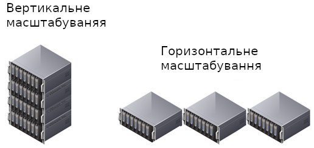

# Highload

## Intro to highload

### Intro to highload

### Що таке Highload?

Перш за все, **highload** - вкрай відносне поняття. Воно ніколи не вимірюється кількістю запитів або швидкістю роботи сайту, тому що попросту немає такого поняття, як "середній сайт". Всі сайти специфічні і однакову кількість запитів може призводити до абсолютно різних навантажень на різні ресурси.

Що ж таке high load (читається "хайлоад")? Знову ж правильним питанням буде швидше - коли закінчується "звичайний" проект і починається highload?

### Коли наступає highload?

- Настає цей момент тоді, коли Ваша поточна інфраструктура починає показувати перші ознаки того, що вона перестає справлятися з навантаженням.

- Якщо у Вас VPS на 128 Мб - для Вас це може бути 10 запитів в секунду. Для кого-то це може бути 10 тисяч запитів. Суть не в них, а в тому, чи існує необхідність для масштабування і оптимізації інфраструктури.

- Якщо Ваш сайт не справляється з навантаженням - все, тепер Ви в клубі highload.

### Що робити в першу чергу?

- Перевірити налаштування веб-сервера: правильно налаштований Web-сервер дозволить істотно розвантажити залізо.

- Найбільш часто проблеми зустрічаються в базах даних. Переконайтеся, що сервер бази даних налаштований під Ваші потреби. Увімкніть лог повільних запитів і використовуйте інструменти для його аналізу.

- Профілювання і оптимізація додатку. Виявлення вузьких мість.

### Нічого не допомагає. Час масштабуватися.

В галузі телекомунікацій і програмного забезпечення, масштабовність є бажаною властивістю системи, мережі, або процесу, яка свідчить про здатність системи обробити більший обсяг роботи або бути легко розширеною.

Можна маштабуватися:

- **горизонтально**
- **вертикально**

### Вертикальне маштабування

**Вертикальне масштабування** - збільшення продуктивності кожного компонента системи з метою підвищення загальної продуктивності. Масштабованість в цьому контексті означає можливість замінювати в існуючій системі автоматичного компоненти більш потужними і швидкими в міру зростання вимог і розвитку технологій. Це найпростіший спосіб масштабування, так як не вимагає ніяких змін в прикладних програмах, що працюють на таких системах.

### Горизонтальне маштабування

**Горизонтальне масштабування** - розбиття системи на більш дрібні структурні компоненти та рознесення їх по окремим фізичним машинам (або їх групам), і (або) збільшення кількості серверів, паралельно виконують одну і ту ж функцію. Масштабованість в цьому контексті означає можливість додавати до системи нові вузли, сервери, процесори для збільшення загальної продуктивності. Цей спосіб масштабування може вимагати внесення змін до програми, щоб програми могли повною мірою користуватися дедалі більшій кількості ресурсів.

### Горизонтальне VS Вертикальне

### Горизонтальне VS Вертикальне

Переваги горизонтального маштабування:
- Миттєва й постійна доступність
- Немає обмежень на потужність обладнання
- Вартість може бути прив'язана до використання

Переваги вертикального маштабування:
- Легкість в реалізації

### Горизонтальне VS Вертикальне в базах даних

Горизонтальне масштабування значно спрощує управління зростаючої IT-інфраструктури. Наприклад, організації середнього розміру спочатку може бути досить двох серверів. З ростом бізнесу, обсягів продажів вимоги будуть ускладнюватися, але горизонтальне масштабування дозволить нарощувати інфраструктуру за допомогою додавання комп'ютерів з аналогічною конфігурацією.

Таким чином, горизонтальне масштабування додає додатковий рівень абстракції, значно полегшуючи управління обладнанням і нарощування інфраструктури.