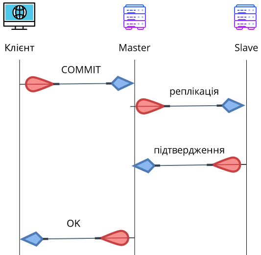

# Highload. Реплікація баз даних


## Intro to highload


### Intro to highload

[](https://www.youtube.com/watch?v=2zlb2E8qkB8&feature=youtu.be)


### Що таке Highload?

Перш за все, **highload** - вкрай відносне поняття. Воно ніколи не вимірюється кількістю запитів або швидкістю роботи сайту, тому що попросту немає такого поняття, як "середній сайт". Всі сайти специфічні і однакову кількість запитів може призводити до абсолютно різних навантажень на різні ресурси.

Що ж таке high load (читається "хайлоад")? Знову ж правильним питанням буде швидше - коли закінчується "звичайний" проект і починається highload?


### Коли наступає highload?

- Настає цей момент тоді, коли Ваша поточна інфраструктура починає показувати перші ознаки того, що вона перестає справлятися з навантаженням.

- Якщо у Вас VPS на 128 Мб - для Вас це може бути 10 запитів в секунду. Для кого-то це може бути 10 тисяч запитів. Суть не в них, а в тому, чи існує необхідність для масштабування і оптимізації інфраструктури.

- Якщо Ваш сайт не справляється з навантаженням - все, тепер Ви в клубі highload.


### Що робити в першу чергу?

- Перевірити налаштування веб-сервера: правильно налаштований Web-сервер дозволить істотно розвантажити залізо.

- Найбільш часто проблеми зустрічаються в базах даних. Переконайтеся, що сервер бази даних налаштований під Ваші потреби. Увімкніть лог повільних запитів і використовуйте інструменти для його аналізу.

- Профілювання і оптимізація додатку. Виявлення вузьких мість.


### Нічого не допомагає. Час масштабуватися.

В галузі телекомунікацій і програмного забезпечення, масштабовність є бажаною властивістю системи, мережі, або процесу, яка свідчить про здатність системи обробити більший обсяг роботи або бути легко розширеною.

Можна маштабуватися:

- **горизонтально**
- **вертикально**


### Вертикальне маштабування

**Вертикальне масштабування** - збільшення продуктивності кожного компонента системи з метою підвищення загальної продуктивності. Масштабованість в цьому контексті означає можливість замінювати в існуючій системі автоматичного компоненти більш потужними і швидкими в міру зростання вимог і розвитку технологій. Це найпростіший спосіб масштабування, так як не вимагає ніяких змін в прикладних програмах, що працюють на таких системах.


### Горизонтальне маштабування

**Горизонтальне масштабування** - розбиття системи на більш дрібні структурні компоненти та рознесення їх по окремим фізичним машинам (або їх групам), і (або) збільшення кількості серверів, паралельно виконують одну і ту ж функцію. Масштабованість в цьому контексті означає можливість додавати до системи нові вузли, сервери, процесори для збільшення загальної продуктивності. Цей спосіб масштабування може вимагати внесення змін до програми, щоб програми могли повною мірою користуватися дедалі більшій кількості ресурсів.


### Горизонтальне VS Вертикальне


### Горизонтальне VS Вертикальне

Переваги горизонтального маштабування:
- Миттєва й постійна доступність
- Немає обмежень на потужність обладнання
- Вартість може бути прив'язана до використання

Переваги вертикального маштабування:
- Легкість в реалізації


### Горизонтальне VS Вертикальне в базах даних

Горизонтальне масштабування значно спрощує управління зростаючої IT-інфраструктури. Наприклад, організації середнього розміру спочатку може бути досить двох серверів. З ростом бізнесу, обсягів продажів вимоги будуть ускладнюватися, але горизонтальне масштабування дозволить нарощувати інфраструктуру за допомогою додавання комп'ютерів з аналогічною конфігурацією.

Таким чином, горизонтальне масштабування додає додатковий рівень абстракції, значно полегшуючи управління обладнанням і нарощування інфраструктури.


## Реплікація баз даних


### Що таке реплікація?

**Реплікація** (англ. Replication) - механізм синхронізації вмісту копій об'єкта (наприклад, вмісту баз даних). Реплікація - це процес, під яким розуміється копіювання даних з одного джерела на інший (або на кількість інших) і навпаки.

При рерлікації зміни, зроблені в одній копії об'єкта, можуть бути поширені в інших копіях.


### Що таке реплікація?


### Що дає реплікація?

- Для додатків з'являється можливість використовувати не один сервер для обробки всіх запитів, а декілька. Таким чином з'являється можливість розподілити навантаження з одного сервера на кілька серверів.
- Відмовостійкість. Якщо одна нода упаде, запити можна перенапрвити на іншу.


### Види реплікації

Існує два основні підходи при роботі з реплікацією даних:
- Реплікація Master-Slave;
- Реплікація Master-Master.

Синхронізація даних, при рекплікації може бути:
- Синхронна
- Асинхронна


### Реплікація Master-Slave

У цьому підході виділяється один основний сервер бази даних, який називається Master. На ньому відбуваються всі зміни в даних (будь-які запити MySQL INSERT / UPDATE / DELETE). Slave сервер постійно копіює всі зміни з Master. З додатка на Slave сервер відправляються запити читання даних (запити SELECT). Таким чином Майстер сервер відповідає за зміни даних, а Слейв за читання.


### Реплікація Master-Slave


### Реплікація Master-Slave
У додатку потрібно використовувати два з'єднання - одне для master, друге - для slave:

```php
&lt;?
$master = mysql_connect('10.10.0.1', 'root', 'pwd');
$slave = mysql_connect('10.10.0.2', 'root', 'pwd');

# ...
mysql_query('INSERT INTO users ...', $master);

# ...
$q = mysql_query('SELECT * FROM photos ...', $slave);
```


### Реплікація Master-Slave. Декілька слейвів

Перевага цього типу реплікації в тому, що Ви можете використовувати більше одного слейв. Зазвичай слід використовувати не більше 20 Слейв серверів при роботі з одним Майстром.


### Реплікація Master-Slave. Декілька слейвів


### Реплікація Master-Slave. Декілька слейвів
Тоді з програми Ви вибираєте випадковим чином один із ідфму - серверів для обробки запитів:

```php
&lt;?
$master = mysql_connect('10.10.0.1', 'root', 'pwd');
$slaves = [
	'10.10.0.2',
	'10.10.0.3',
	'10.10.0.4',
];
$slave = mysql_connect($slaves[array_rand($slaves)], 'root', 'pwd');

# ...
mysql_query('INSERT INTO users ...', $master);

# ...
$q = mysql_query('SELECT * FROM photos ...', $slave);
```


### Master-Slave відмовостійкість

- При виході з ладу slave - сервера, досить просто перемкнути всі додатоки на роботу з master- сервером. Після відновити реплікацію на slave і знову його запустити.
- Якщо виходить з ладу master, потрібно переключити всі операції (і читання і запису) на slave. Таким чином він стане новим master - сервером. Після відновлення старого master - серверу, налаштувати на ньому репліку, і він стане новим слейв.


### Master-Slave резервування

Набагато частіше реплікацію Master-Slave використовують не для масштабування, а для резервування. В цьому випадку, Master - сервер обробляє всі запити від програми. Слейв сервер працює в пасивному режимі. Але в разі виходу з ладу Master - сервера, всі операції переключаються на Slave.


### Реплікація Master-Master

У цій схемі, будь-який з серверів може використовуватися як для читання так і для запису.


### Реплікація Master-Master
При використанні такого типу реплікації досить вибирати випадкове з'єднання з доступних Майстрів:

```php
&lt;?
$masters = [
	'10.10.0.1',
	'10.10.0.2',
	'10.10.0.3',
];
$master = mysql_connect($masters[array_rand($masters)], 'root', 'pwd');
```


## Синхронізація даних між репліками


### Асинхронна реплікація


### Синхронна реплікація




## Налаштування реплікації в MySQL


### Етап 1
На сервері, який буде виступати майстром, необхідно внести правки в my.cnf:

```
# Вибираємо ID сервера, довільне число, краще починати з 1
server-id = 1
# Шлях до бінарного лога
log_bin = /var/log/mysql/mysql-bin.log
# Назву бази даних репліки
binlog_do_db = newdatabase
```
Перезапускаємо Mysql:
```
/etc/init.d/mysql restart
```


### Етап 2

Далі необхідно створити профіль користувача, з під якого відбуватиметься реплікація. Для цього запускаємо консоль:
```
mysql -u root -p
```
Далі створюємо і призначаємо права користувачеві для репліки:
```
GRANT REPLICATION SLAVE ON *.* TO 'slave_user'@'%' IDENTIFIED BY 'password';
FLUSH PRIVILEGES;
```
Далі блокуємо всі таблиці в нашій базі даних:
```
USE newdatabase;
FLUSH TABLES WITH READ LOCK;
```


### Етап 3
Тепер необхідно зробити дамп бази даних:
```
mysqldump -u root -p newdatabase > newdatabase.sql
```
Розблокуємо таблиці в консолі mysql:
```
UNLOCK TABLES;
```


### Етап 4
В консолі mysql на слейв створюємо базу з таким же ім'ям, як і на Майстрі:
```
CREATE DATABASE newdatabase;
```
Після цього завантажуємо дамп (з bash):
```
mysql -u root -p newdatabase < newdatabase.sql
```


### Етап 4
В налаштуваннях my.cnf на слейв необхідно вказати такі параметри:
```
# ID слейв, зручно вибирати таким числом після Майстри
server-id = 2
# Шлях до relay
relay-log = /var/log/mysql/mysql-relay-bin.log
# Шлях до bin на Майстрі
log_bin = /var/log/mysql/mysql-bin.log
# База даних для реплікації
binlog_do_db = newdatabase
```


### Етап 6
Нам залишилося включити реплікацію, для цього необхідно вказати параметри підключення до майстра. В консолі mysql на слейв необхідно виконати запит:
```
CHANGE MASTER TO MASTER_HOST='10.10.0.1', MASTER_USER='slave_user', MASTER_PASSWORD='password',
MASTER_LOG_FILE = 'mysql-bin.000001', MASTER_LOG_POS = 107;
```
Після цього запускаємо реплікацію на слейв:
```
START SLAVE;
```


## Налаштування реплікації в MySQL з використанням Docker


### Налаштування реплікації в MySQL з використанням Docker
Docker дозволяє легко запускати декілька незалежних екземплярів mysql на одній машині.


### Налаштування реплікації в MySQL з використанням Docker
Приклад реплікації за допомогою Docker можна взяти із **https://github.com/endlesskwazar/distributed-databases-examples** гілка example3.
Запуск і тестування:
```
docker-compose up -d
```
```
docker-compose logs -f mysqlconfigure
```
```
docker-compose exec mysqlmaster mysql -uroot -proot -e "CREATE DATABASE test_replication;"
```
```
docker-compose exec mysqlslave mysql -uroot -proot -e "SHOW DATABASES;"
```


## Ручна реплікація


### Ручна реплікація
Слід пам'ятати, що реплікація - це не технологія, а методика. Вбудовані механізми реплікації можуть принести непотрібні ускладнення або не мати якийсь потрібної функції. Деякі технології взагалі не мають вбудованої реплікації.

У таких випадках, слід використовувати самостійну реалізацію реплікації. У найпростішому випадку, додаток буде дублювати всі запити відразу на кілька серверів бази даних.


### Ручна реплікація

```php
&lt;?
dbs = [
	'10.10.0.1',
	'10.10.0.2'
];

foreach ( dbs as db )
{
	connection = mysql_connect(db, 'root', 'pwd');
	mysql_query('INSERT INTO users ...', connection);
}

connection_read = mysql_connect(dbs[array_rand(dbs)], 'root', 'pwd');
mysql_query('SELECT * FROM users WHERE ...', connection_read);
```


## Summary

Реплікація використовується в більшій мірі для резервування баз даних і в меншій для масштабування. Master-Slave реплікація зручна для розподілу запитів читання по декількох серверах. Master - Master реплікація складна в налаштуванні.