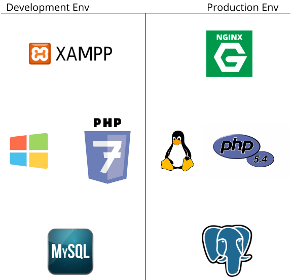
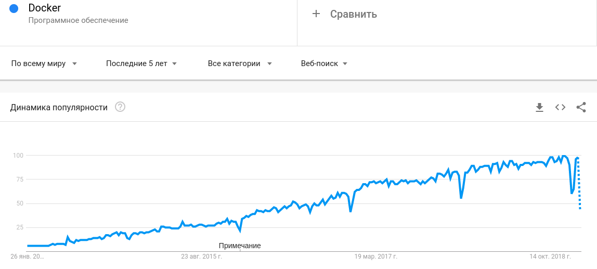
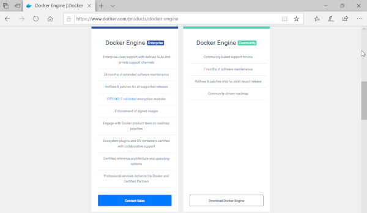
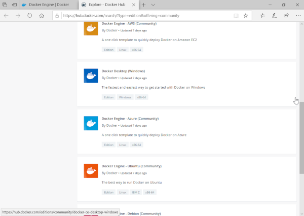
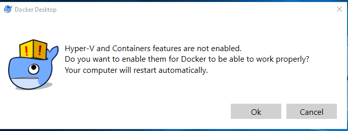
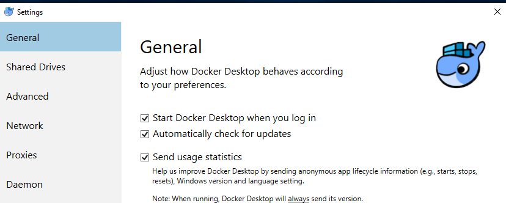

# Docker


## Що таке Docker?


### Що таке Docker?



### Що таке Docker?
- **Docker** — інструментарій для управління ізольованими Linux-контейнерами. Docker доповнює інструментарій LXC більш високорівневим API, що дозволяє керувати контейнерами на рівні ізоляції окремих процесів.

- **Docker** - це відкрита платформа для розробки, доставки і експлуатації додатків.


### Що таке Docker?



### Відмінність від віртуалізації
Спочатку віртуалізація була покликана позбавити від подібних проблем, але в ній є суттєві недоліки:

- повільне завантаження;
- можлива плата за надання додаткового простору;
- не всі віртуальні машини (VM) підтримують сумісний використання;
- підтримують VM часто вимагають складної настройки;
- образ може бути занадто великим, так як «додаткова ОС» додає гігабайт простору в проект поверх операційної системи, а в більшості випадків на сервер ставиться кілька VM, які займають ще більше місця


### Платформи
Докер працює не тільки на його рідній ОС, Linux, але також підтримується Windows і macOS. Єдина відмінність від взаємодії з Linux в тому, що на macOS і Windows платформа инкапсулируется в крихітну віртуальну машину. На даний момент Докер для macOS і Windows досяг значного рівня зручності у використанні.

Крім того, існує безліч додаткових додатків, таких як Kitematic або Docker Machine, які допомагають встановлювати і використовувати Docker на платформах, відмінних від Linux.


## Установка Docker


### Установка Docker

Перейдіть на сайт [https://www.docker.com](https://www.docker.com):


### Установка Docker

З розділу Products виберіть Docker Engine. Нас цікавить Docker Engine Comminity:




### Установка Docker

У новій вкладці Docker Hub виберіть Docker Desktop for Windows:




### Установка Docker
Щоб мати змогу завантажити Docker потрібно ввійти або створити оьліковий запис в Docker Hub(це безкоштовно). Після чього стане доступка кнопка Get Docker:


### Установка Docker
Запустіть скачаний файл і установіть Docker залишивши всі параметри за замовчуванням після чього перезайдіть в систему:


### Установка Docker
Після того як Ви перезайшли в систему Docker спробує запуститися. Тут існує доволі вилика імовірність того, що це не вдасться. Справа в тім, що Docker потребує для своєї роботи Hyper-V, який за замовчуванням вимкнений в операційній системі Windows. Docker видасть повідомлення про те, що Hyper-V не ввімкнено і запропонує це зробити. Натискаємо Ok, після чого система перезавантажиться. 




### Установка Docker
Після перезавантаження Docker повинен успішно запуститися:


### Установка Docker
Для перевірки роботоспособності Docker відкрийте Power Shell і виконайте команду:

```bash
docker -v
```


### Рекомендаії із налаштування
Після встановлення Docker він буде автоматично запускатися при старті системи, але це не завжди прийнятний варіанти. Ввимкнути автостарт Docker можна в налаштуваннях:




### Рекомендаії із налаштування
За замовчуванням Docker намагатиметься взяти половину можливих ресурсів хостової операційної системи. Цю поведінку також можна змінити в налаштуваннях:


## Основні терміни, при роботі з Docker`ом


### Основні терміни, при роботі з Docker`ом
Щоб розуміти, з чого складається docker, вам потрібно знати про три компоненти:

- зоображення (images)
- реєстр (registries)
- контейнери


### Зоображення (images)
> **Docker-зоображення** - це read-only шаблон. Наприклад, образ може містити операційну систему Ubuntu c Apache і додатком на ній. Образи використовуються для створення контейнерів. Docker дозволяє легко створювати нові образи, оновлювати існуючі, або ви можете завантажити образи створені іншими людьми. Образи - це компонента збірки docker-а.


### Реєстр (registries)
> **Docker-реєстр** зберігає зоображення. Є публічні і приватні реєстри, з яких можна скачати або завантажити образи. Публічний Docker-реєстр - це Docker Hub. Там зберігається величезна колекція образів. Як ви знаєте, образи можуть бути створені вами або ви можете використовувати образи створені іншими. Реєстри - це компонента поширення.


### Контейнери
> **Контейнери** схожі на директорії. У контейнерах міститься все, що потрібно для роботи програми. Кожен контейнер створюється з образу. Контейнери можуть бути створені, запущені, зупинені, перенесені або видалені. Кожен контейнер ізольований і є безпечною платформою для додатка. Контейнери - це компонента роботи.


## Docker Hello World


### Docker Hello World
```bash
$ docker run hello-world
```

Ця команда завантажить образ Docker hello-world з Dockerhub, якщо він вже не присутній, і запустити його.


## Docker Ubuntu bash example. Імена контейнерів


### Docker Ubuntu bash example. Імена контейнерів
```bash
$ docker run -ti ubuntu
```

В результаті ми отримаємо дієспособну систему Ubuntu, в якій запущений bash. Всі команди, які ми почнемо зараз вводити будуть ви конуватися на Ubuntu.


### Docker Ubuntu bash example. Імена контейнерів
Даватйе створимо новий файл в каталозі home:

```bash
$ cd home
$ touch hello.txt
$ ls
```

- cd - зміна робочої директорії
- Команда touch (1) використовується для зміни тимчасової мітки файлу. За допомогою цієї команди ви можете змінювати час доступу до файлу і час його зміни. Якщо вказаний файл не існує, touch створить файл нульового розміру з вказаним ім'ям.

Тепер зупинимо контейнер, для чого можна натиснути комбінацію клавіш CTRL + D, або виконавши команду exit:


### Docker Ubuntu bash example. Імена контейнерів
Запустимо контейнер заново і спробуємо знайти файл, який ми створили раніше:

```bash
$ docker run -ti ubuntu
$ ls
$ cd home
$ ls
```


### Docker Ubuntu bash example. Імена контейнерів
Файл hello.txt відсутній. Справа в тім, що ми запустили два різних контейнера на основі зоображення Ubuntu:

```bash
$ docker container ls -a
```


### Docker Ubuntu bash example. Імена контейнерів
Кожному контейнеру було дано випадкове значення CONTAINER ID. Ми можимо використати це значення для того, щоб запустити потрібний нам контейнер:

```bash
$ docker start -i 418
$ cd home
$ ls
```
Зверніть увагу, що працюючи з CONTAINER ID не обов'язково прописувати його повністю, достатньо вказати мінімальну його частину для однозначної ідентифікації.

> docker start - запуск існуючого контейнера


### Docker Ubuntu bash example. Імена контейнерів
Існують ситуації, що варінт із випадковим ідентифікатором нас не влаштовують, для цього docker передбачає можливість вказати ім'я контейнера.

```bash
$ docker run -ti --name=my_ubuntu ubuntu
```

> --name - параметр, який дозволяє задати ім'я для контейнера


### Docker Ubuntu bash example. Імена контейнерів
Запустити контейнер my_ubuntu можна командою:

```bash
$ docker start -i my_ubuntu
```


## Detached/Attached


### Detached/Attached
Під час запуску контейнера необхідно спочатку вирішити, чи потрібно запустити контейнер у фоновому режимі(detached mode) або в режимі переднього плану за замовчуванням. Ви можете використовувати detached mode, якщо ви хочете, щоб контейнер виконувався, але не хочете переглядати і слідувати за всім його виведенням.

Часто ви побачите коротку версію опції detach, що використовується, -d, а довша версія --detach:

```bash
$ docker run -d IMAGE
```


### Detached/Attached
Спробуємо запустити Ubuntu в detached mode:

```bash
$ docker run -d -i --name=d_ubuntu ubuntu
```

Нівадміну від попередніх прикладів зараз ми не можемо вводити команди в терманіл, щойно запущеної Ubuntu.


### Detached/Attached
Після запуску контейнерів у відключеному режимі ви можете переглядати їх, використовуючи командну панель керування командами CLI docker ps.

За замовчуванням в ньому перелічено запущені контейнери. Деякі корисні варіанти включають:

- -a/-all список всіх контейнерів

```bash
$ docker ps -a
```


### Detached/Attached
exec - запускає команду в активному контейнері.

```bash
docker exec [OPTIONS] CONTAINER COMMAND [ARG...]
```

Для того щоб запустити команду, наприклад bash у контейнері d_ubuntu достатньо виконати команду:

```bash
docker exec -it d_ubuntu bash
```


## Node.js single script example


### Node.js single script example
Створіть директорію і в ній файл index.js.

Вміст файлу index.js:

```js
console.log("Hello from node in Docker!!!");
```


### Node.js single script example
Для того щоб запустити файл index.js на Node.js можна наступною командою:

```bash
$ docker run -it --rm --name my-running-script -v "$PWD":/usr/src/app -w /usr/src/app node:8 node index.js
```

- **--rm** - видаляє зупинений контейнер
- **-v** - Том - це спеціально призначений каталог у межах одного або декількох контейнерів, який обходить файлову систему Union.
- **node index.js** - команда, яка буде виконана в контейнері


## Node.Js port mapping


### Node.JS port mapping
Модифікуємо index.js наступним чином:

```js
const http = require('http');
const port = 3000;

const requestHandler = (request, response) => {
    console.log(request.url);
    response.end('Hello Node.js Server!');
}

const server = http.createServer(requestHandler);

server.listen(port, (err) => {
    if (err) {
        return console.log('something bad happened', err)
    }
    console.log(`server is listening on ${port}`)
})
```


### Node.JS port mapping
Запустимо скрипт вже відомою нам командою:

```bash
$ docker run -it --rm --name my-running-script -v "$PWD":/usr/src/app -w /usr/src/app node:8 node index.js
```


### Node.JS port mapping
За замовчуванням, коли ви створюєте контейнер, він не публікує жоден зі своїх портів у зовнішній світ. Щоб зробити порт доступним для служб за межами Docker, або до контейнерів Docker, які не підключені до мережі контейнера, використовуйте параметр --publish або -p. Це створює правило брандмауера, який відображає порт контейнера до порту на хості Docker. Ось кілька прикладів.


### Node.JS port mapping
|Параметр|Пояснення|
|-|-|
|-p 8080:80|Зв'язує порт TCP 80 у контейнері до порту 8080 на хості Docker.|
|-p 192.168.1.100:8080:80|Зв'язує TCP-порт 80 у контейнері до порту 8080 на хості Docker для підключення до IP-адреси 192.168.1.100.|
|-p 8080:80/udp|Зв'язує UDP-порт 80 у контейнері на порт 8080 на хості Docker.|


### Node.JS port mapping
Модифікуємо команду запуска контейнера, включивши до нього команду для зв'язання порту:

```bash
$ docker run -it --rm --name my-running-script -v "$PWD":/usr/src/app -w /usr/src/app -p 3000:3000 node:8 node index.js
```


## Dockerfile


### Dockerfile
Dockerfile містить набір інструкцій з аргументами. Кожна інструкція пишеться великими літерами (наприклад FROM). Інструкції обробляються зверху вниз. Кожна інструкція додає новий шар в образ і зберігає зміни. Docker виконує інструкції, дотримуючись процесу:
- Запуск контейнера з образу
- Виконання інструкції та внесення змін до контейнер
З- апуск еквівалента docker commit для запису змін в новий шар образу
- Запуск нового контейнера з нового образу
- Виконання наступної інструкції в файлі і повторення кроків процесу.


### Dockerfile
Це означає, що якщо виконання Dockerfile зупиниться з якоїсь причини (наприклад інструкція не зможе завершитися), ви зможете використовувати образ до цієї стадії. Це дуже корисно при відлагодженні: ви можете запустити контейнер з образу інтерактивно і дізнатися, чому інструкція не виконалася, використовуючи останній створений образ.

Також Dockerfile підтримує коментарі. Кожен рядок, що починається з # означає коментар.


## Ubuntu/NGINX Dockerfile


### Ubuntu/NGINX Dockerfile
Додамо в Dockerfile інформацію з побудови образу:

```
# Version: 0.0.1
FROM ubuntu:14.04
MAINTAINER endlesskwazar <endlesskwazar@gmail.com>
RUN apt-get update
RUN apt-get install -y nginx
RUN echo 'Hi, I am in your container' \
        >/usr/share/nginx/html/index.html
ENTRYPOINT service nginx restart && bash
EXPOSE 80
```


### Ubuntu/NGINX Dockerfile
- Перша інструкція в Dockerfile завжди повинна бути FROM, яка вказує, з якого базового образу потрібно побудувати наший. У нашому прикладі ми будуємо образ з базового образу ubuntu версії 14:04.
- Далі ми вказуємо інструкцію MAINTAINER, що повідомляє Docker про автора образу і його email. Це корисно, щоб користувачі образу могли зв'язатися з автором при необхідності.
- Інструкція RUN виконує команду в конкретному образі. У нашому прикладі за допомогою її ми оновлюємо APT репозиторії і встановлюємо пакет з NGINX, потім створюємо файл /usr/share/nginx/html/index.html.


### Ubuntu/NGINX Dockerfile
- Інструкція ENTRYPOINT вказує, яку команду необхідно запустити, коли контейнер запущений. На відміну від команди RUN зазначена команда виконується не під час побудови образу, а під час запуску контейнера.
- Далі ми вказуємо інструкцію EXPOSE, яка говорить Docker, що додаток в контейнері повинен використовувати певний порт в контейнері. Це не означає, що ви можете автоматично отримувати доступ до сервісу, запущеного на порту контейнера (в нашому прикладі порт 80). З міркувань безпеки Docker не відчиняє порт автоматично, але очікує, коли це зробить користувач в команді docker run. Ви можете вказати безліч інструкцій EXPOSE для вказівки, які порти повинні бути відкриті. Також інструкція EXPOSE корисна для проброса портів між контейнерами.


### Ubuntu/NGINX Dockerfile
Для того щоб побудувати зоображення потрібно використати команду:

```cpp
docker build -t endlesskwazar/docfileexml .
```

Тепер запустимо зоображення командою:

```bash
docker container run -it -p 80:80 --name=my-image endlesskwazar/docfileexml
```


## Node.js Dockerfile example


### Node.js Dockerfile example
Склонуйте репозиторій https://github.com/endlesskwazar/distributed-databases-examples.git. Перейдіть на гілку example1.

Для того щоб побудувати зоображення виконайте команду:
```
docker build -t <your username>/node-web-app .
```
Для того щоб запустити контейнер виконайте команду:
```
docker run -p 49160:8080 -d <your username>/node-web-app
```
Перейдіть за адресою localhost:49160


## COPY vs ADD


### COPY vs ADD
В одному із минулих прикладів, ми створювали новий файл всередині контейнера, але часто існує потреба передати файли із хостової операційної системи в контейнер. Для цієї задачі в docker існують два способи:

- COPY
- ADD


### COPY vs ADD
- COPY - копіює один або декілька локальних файлів або папок у пункт призначення у своєму зображенні Docker.

```bash
COPY <source>... <destination>
COPY ["<source>",... "<destination>"]
```


### COPY vs ADD
Інструкція ADD має подібний синтаксис до COPY.

```bash
ADD <source>... <destination>
ADD ["<source>",... "<destination>"]
```

Окрім копіювання локальних файлів і каталогів у пункт призначення на зображенні Docker, він має деякі додаткові функції:
- Якщо &lt;source&gt; є локальним архівом tar у розпізнаному форматі стиснення, то він автоматично розпаковується у вигляді каталогу до зображення Docker. Наприклад: ADD rootfs.tar.xz /
- Якщо &lt;source&gt; є URL-адресою, то він завантажуватиме та копіюватиме файл у пункті призначення, розташованого на зображенні Docker. Однак Docker не рекомендує використовувати ADD для цієї мети.


## Docker Compose


### Docker Compose
- **Docker-compose** це простий інструмент, який дозволяє налаштувати і запустити кілька контейнерів однією командою.

Вся конфігурація для docker-compose описується в файлі docker-compose.yml, який зазвичай лежить в корені проекту.

В прикладі ми будемо використовувати ["monorepo"](https://cacm.acm.org/magazines/2016/7/204032-why-google-stores-billions-of-lines-of-code-in-a-single-repository/fulltext). Код кожного сервісу (frontend, api, worker, etc) знаходиться в своїй директорії і має Dockerfile. Приклад структури проекту можна подивитися [тут](https://github.com/auxilincom/docker-compose-starter).


## Node.Js і MongoDB


### Node.Js і MongoDB
Почнемо з автоматизації простого Node.JS застосунка, яке працює з базою даних MongoDB. Ось так буде виглядати конфігураційний файл:

```yaml
version: '2'
services:
  web:
    build:
      context: ./web
      dockerfile: Dockerfile.dev
    volumes:
      - "./web/src:/web/src"
    ports:
      - "8080:8080"
  mongo:
    command: mongod
    image: mongo:3.2.0
    ports:
      - "27017:27017"
    volumes:
      - /var/run/docker.sock:/var/run/docker.sock
```


### Node.Js і MongoDB
Щоб запустити проект, нам знадобитися одна команда:

```bash
docker-compose up
```


### Node.Js і MongoDB
При першому старті, всі контейнери будуть побудовані або завантажені. Якщо ви працювали з Docker, конфігураційний файл для docker-compose повинен бути більш-менш зрозумілий, але варто звернути увагу на кілька деталей:

- context: ./web - таким чином вказується шлях до докер файлу сервісу всередині нашого каталогу.
- dockerfile: Dockerfile.dev - ми використовуємо окремий Dockerfile.dev для робочих оточень. Для "production" оточень, ми копіюємо код в образ Docker, а на робочих середовищах ми додаємо код як "volume". При використанні "volume" не доводиться перезапускати docker-compose кожен раз після змін в коді.


### Node.Js і MongoDB
- volumes: - "./web/src:/web/src" - так код додається як "volume" в Docker.
- Docker-compose автоматично "пов'язує" контейнери. Завдяки цьому є можливо звертатися до сервісу по імені. Наприклад, з сервісу web ви можете підключиться до бази даних MongoDB: mongodb: // mongo: 27017


### Node.Js і MongoDB
Приклад проекту можна подивитися на **https://github.com/endlesskwazar/distributed-databases-examples**. Гілка **example2**.


## Завжди використовуйте --build


### Завжди використовуйте --build
За замовчуванням, docker-compose up не буде перебудовувати контейнери, якщо вони вже є на хості. Щоб змусити докер робити це, потрібно використовувати аргумент --build. Зазвичай це потрібно, коли сторонні залежності проекту змінюються або змінюється докерфайл. В нашій команді ми завжди використовуємо docker-compose up --build. Docker вміє кешувати шари і не буде перебудовувати контейнера, якщо нічого не змінилося. При використанні --build повсюдно, ви, можливо, втратите кілька секунд при старті програми. Але, при цьому ви ніколи не зіштовхнетеся з магічними проблемами запуску нової версії додатка зі старими залежностями.
