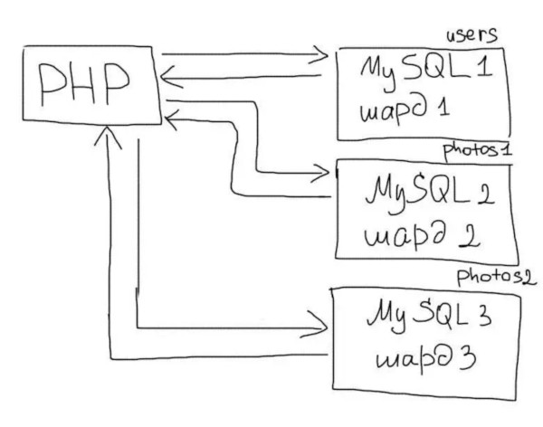
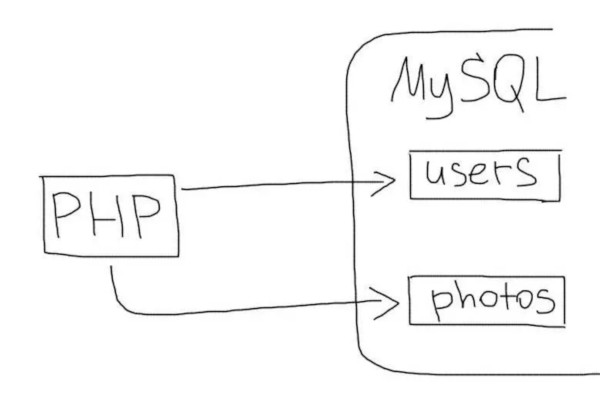
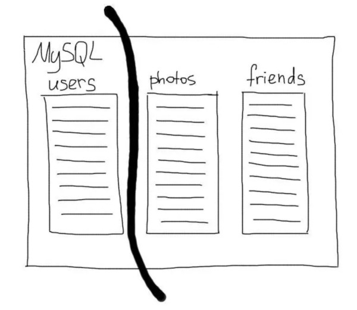
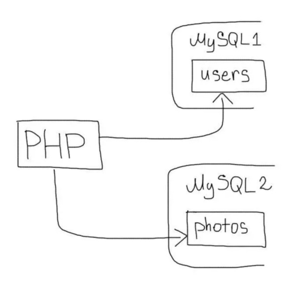
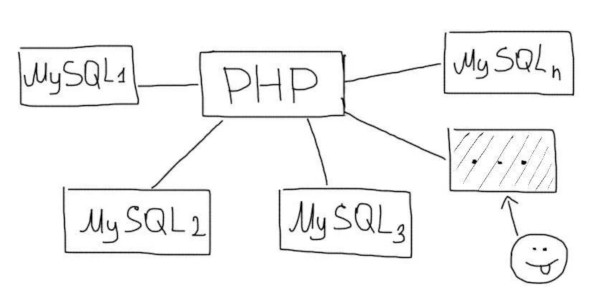
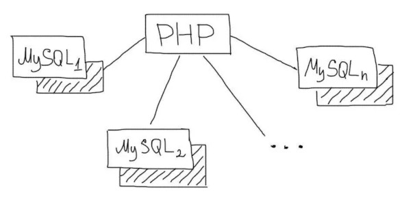

# Шардування бази даних


## Що таке шардинг


### Що таке шардинг?
**Шардинг** - це техніка масштабування роботи з даними. Суть його в поділі (партіціонірованіе) бази даних на окремі частини так, щоб кожну з них можна було винести на окремий сервер. Цей процес залежить від структури Вашої бази даних і виконується прямо в додатку на відміну від реплікації.


### Що таке шардинг?



### Що таке шардинг?
Шардинг буває **вертикальний** і **горизонтальний**.


## Вертикальний шардинг


### Вертикальний шардинг
Зазвичай Web додатки працюють з одним сервером бази даних. У більшості випадків додаток використовує більше однієї таблиці.




### Вертикальний шардинг
Однією з технік масштабування бази даних є поділ таблиць по різних серверах. У цьому випадку кілька таблиць будуть знаходиться на одному сервері, а інші на іншому. Тоді запити до різних таблицях будуть оброблятися різними серверами бази даних. Це і називається **вертикальним шардінгом**.


### Вертикальний шардинг



### Вертикальний шардинг
Сервера з різними таблицями називаються Шардена. Деякі таблиці зазвичай більше за інших. Шардінг зазвичай починають з найбільш великих і навантажених таблиць. Їх виділяють в окрему групу і виносять на окремий сервер.


### Вертикальний шардинг



### Вертикальний шардинг
Наприклад, в додатку є такі таблиці:
- users
- photos
- albums

Таблицю users Ви залишаєте на одному сервері, а таблиці photos і albums переносите на інший. В такому випадку в додатку Вам необхідно буде використовувати відповідне з'єднання для роботи з кожною таблицею:


### Вертикальний шардинг
```php
<?
$ Users_connection = mysql_connect ('10 .10.0.1 ',' root ',' pwd ');
$ Photos_connection = mysql_connect ('10 .10.0.2 ',' root ',' pwd ';

# Якийсь код і все таке ...
$ Q = mysql_query ( 'SELECT * FROM users WHERE ...', $ users_connection);

# Ще якийсь код ...
$ Q = mysql_query ( 'SELECT * FROM photos WHERE ...', $ photos_connection);

# Ще якийсь код ...
$ Q = mysql_query ( 'SELECT * FROM albums WHERE ...', $ photos_connection);
```


### Join`s
Зрозуміло, що JOIN двох таблиць на різних серверах зробити неможливо. Є два варіанти вирішення цього завдання.


### Групи таблиць
Часто JOIN запити мають місце тільки між якоюсь групою таблиць, які логічно пов'язані один з одним. Наприклад таблиці, які зберігають дані про альбоми та фотографії користувачів:
- photos
- albums

В такому випадку зручніше виносити на окремий шард відразу всю групу цих таблиць. Це дозволить використовувати JOIN в рамках цієї групи.


### Вибірка в додатку
В іншому варіанті, функціональність JOIN'a доведеться перенести на додаток. Наприклад, такий запит:

```sql
SELECT * FROM photos p JOIN albums a ON (a.id = p.album_id) WHERE a.user_id = 1
```


### Вибірка в додатку
```php
<?
# ...
$q = mysql_query('SELECT * FROM albums WHERE user_id = 1', $connection_albums);
$albums = mysql_fetch_all($q);

# Отримуємо список ID альбомів користувача
foreach ( $albums as $album ) $album_ids[] = $album['id'];

# Вибираємо всі фотки для зазначених альбомів
$q = mysql_query('SELECT * FROM photos WHERE album_id IN (' . implode(',', $album_ids) . ')', $connection_photos)
```


## Горизонтальний шардинг


### Горизонтальний шардинг
**Горизонтальний шардінг** - це поділ однієї таблиці на різні сервера. Це необхідно використовувати для величезних таблиць, які не поміщаються на одному сервері. Поділ таблиці на шматки робиться за таким принципом:
- На кількох серверах створюється одна і та ж таблиця (тільки структура, без даних).
- У додатку вибирається умова, за яким буде визначатися потрібне з'єднання (наприклад, парні на один сервер, а непарні - на інший).
- Перед кожним зверненням до таблиці відбувається вибір потрібного з'єднання.


### Горизонтальний шардинг
Припустимо, наш додаток працює з величезною таблицею, яка зберігає фотографії користувачів. Ми підготували два сервера (зазвичай вони називаються Шарден) для цієї таблиці. Для непарних користувачів ми будемо працювати з першими сервером, а для парних - з другим. Таким чином, на кожному з серверів буде тільки частина всіх даних про фотках користувачів. Це буде виглядати так:


### Горизонтальний шардинг
```php
<?
# Список з'єднань для таблиці з фотками
$ Photo_connections = [
'1' => '10 .10.0.1 ',
'2' => '10 .10.0.2 ',
];
$ User_id = $ _SESSION [ 'user_id'];
# Отримання фотографій для користувача $ user_id
$ Connection_num = $ user_id% 2 == 0? 1: 2;
$ Connection = mysql_connect ($ photo_connections [$ connection_num], 'root', 'pwd');
$ Q = mysql_query ( 'SELECT * FROM photos WHREE user_id ='. Intval ($ user_id), $ connection);
```


### Горизонтальний шардинг
Горизонтальний шардінг - це дуже потужний інструмент масштабування даних. Але в той же час і дуже нетривіальний.

Не слід застосовувати техніку шардінга до всіх таблиць. Правильний підхід - це поетапний процес поділу зростаючих таблиць. Слід замислюватися про горизонтальному шардінге, коли кількість записів в одній таблиці переходить за межі від кількох десятків мільйонів до сотень мільйонів.


## Відмовостійкість


### Відмовостійкість
Імовірність поломки серверів баз даних збільшується зі зростанням їх кількості.




### Відмовостійкість
Для забезпечення відмовостійкості необхідно резервувати сервера баз даних за допомогою реплікації. В такому випадку, кожен шард матиме резервний сервер з копією даних.




### Відмовостійкість
У разі виходу з ладу одного з Шардена досить буде переключити його з'єднання на резервний сервер.


## ShardingSphere


### ShardingSphere
[ShardingSphere](https://shardingsphere.apache.org/) is an open-source ecosystem consisted of a set of distributed database middleware solutions, including 3 independent products, Sharding-JDBC, Sharding-Proxy & Sharding-Sidecar (todo). They all provide functions of data sharding, distributed transaction and database orchestration, applicable in a variety of situations such as Java isomorphism, heterogeneous language and cloud native.


### Sharding-JDBC
**Sharding-JDBC** defines itself as a lightweight Java framework that provides extra service at Java JDBC layer. With client end connecting directly to the database, it provides service in the form of jar and requires no extra deployment and dependence. It can be considered as an enhanced JDBC driver, which is fully compatible with JDBC and all kinds of ORM frameworks.


### Sharding-JDBC
- Applicable in any ORM framework based on Java, such as JPA, Hibernate, Mybatis, Spring JDBC Template or direct use of JDBC.
- Based on any third-party database connection pool, such as DBCP, C3P0, BoneCP, Druid, HikariCP.
- Support any kind of database that conforms to JDBC standard: MySQL，Oracle，SQLServer and PostgreSQL for now.


### Sharding-JDBC demo

demo in workbook
