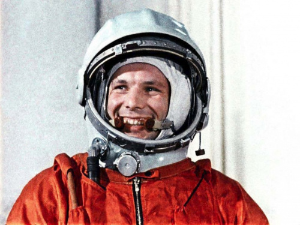
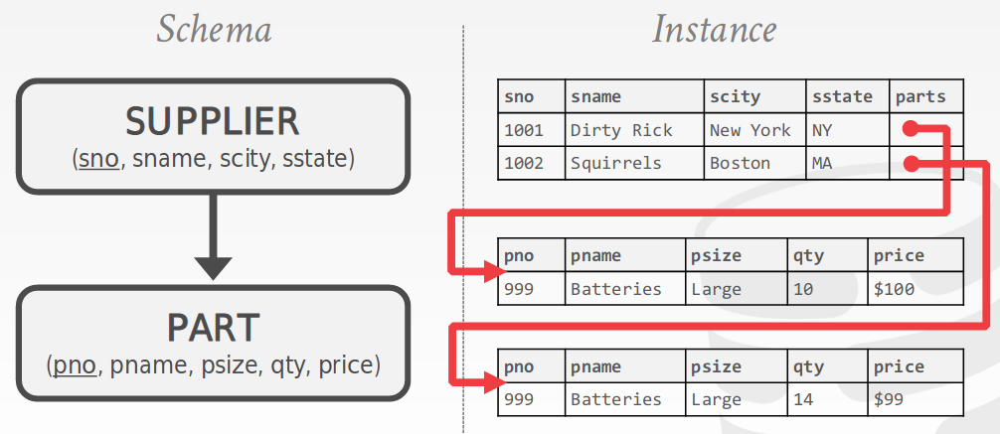
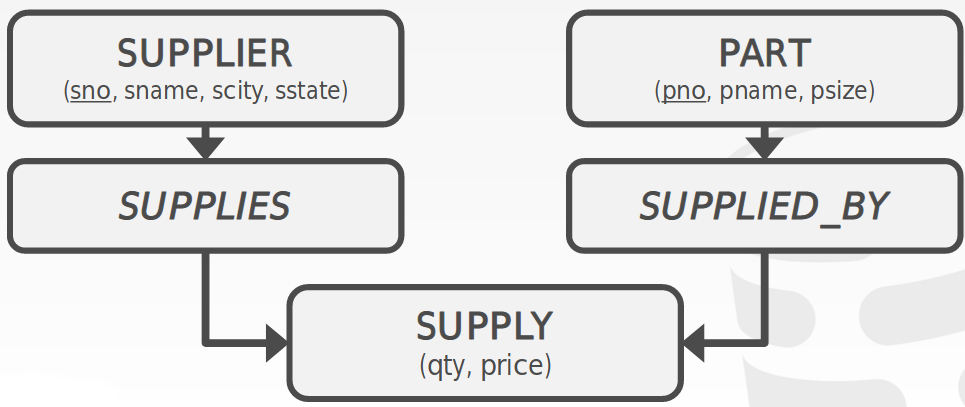
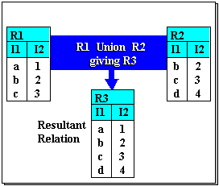

# NoSQL

## Relation databases history

### Relation databases history
Старт корабля «Восток-1» був проведений 12 квітня 1961 о 09:07 за московським часом з космодрому Байконур. Через чотирнадцять хвилин Гагарін, використовуючи свій позивний «Кедр», доповів про настання стану невагомості.

### Relation databases history
Програма «Аполлон» - програма пілотованих космічних польотів космічного агентства США НАСА, прийнята в 1961 році з метою здійснення першої пілотованої висадки на Місяць і завершена в 1975 році. Президент Джон Ф. Кеннеді сформулював завдання в своїй промові [1] 12 вересня 1961 року, що і вона була вирішена 20 липня 1969 року о ході польоту «Аполлон-11» висадкою Ніла Армстронга і Базза Олдрина.

### Relation databases history
IBM спроектувала IMS у співпраці з компаніями Rockwell і Caterpillar для космічної програми Аполлон в 1966 році. У завдання IMS входила обробка специфікації вироби (англ. Bill of materials) для ракети Сатурн-5 і кораблів Аполлон.

Датою випуску системи вважається 14 серпня 1968 року.

### Relation databases history
Особливості IBM IMS:
- Ієрархічна модель даних
- Структури даних вибаються користувачем
- Запити на мові програмування

### Relation databases history

### Relation databases history
CODASYL (англ. COnference on DAta SYstems Language - «Конференція по мовам систем обробки даних») - організація, яка брала активну участь в еволюції інформаційних технологій в 60-80-і роки XX століття. Заснована в 1959 для розробки стандартного мови програмування для комерційних систем. Ця мова отримав назву COBOL.

### Relation databases history
Програмісти COBOL запропонували стандарт, доступу до бази даних:
- Мережева модель
- Запити на мові програмування

### Relation databases history

### Relation databases history
Едгар Франк «Тед» Кодд (23 серпня 1923 — 18 квітня 2003) — британський дослідник в галузі інформатики, який, працюючи у IBM, винайшов, окрім іншого, реляційну модель даних для керування базами даних, теоретичну основу для реляційних баз даних. 

Написав наукову працю під назвою [«Реляційна модель даних для великих спільних обсягів даних»](https://www.seas.upenn.edu/~zives/03f/cis550/codd.pdf) (англ. "A Relational Model of Data for Large Shared Data Banks")

### Relation databases history
Реляційна алгебра базується на теорії множин і є основою логіки роботи баз даних.

**Реляційною базою даних** називається сукупність відносин, що містять всю інформацію, яка повинна зберігатися в базі.

### Relation databases history

### Relation databases history
Перві імплементації:
- System R - IBM Research
- INGRES - U.C.Berkeley
- Oracle - Larry Ellison

### Relation databases history
**Smalltalk** (вимовляється [смо́лток]) — об'єктно-орієнтована мова програмування з динамічною типізацією, розроблена в Xerox PARC Аланом Кейем, Деном Інгаллсом, Тедом Кеглером, Адель Голдберг в 1970-х роках.

**C++** виник на початку 1980-х років, коли співробітник фірми Bell Labs Бйорн Страуструп придумав ряд удосконалень до мови C під власні потреби.

### Relation databases history
В 1980-х починають виникати об'єктно реляційні бази даних, які дозволяють усунути несумісність схем.

Недоліки:
- Складні запити
- Немає стандарних API

## Переваги і недоліки реляційних БД

### Переваги і недоліки реляційних БД