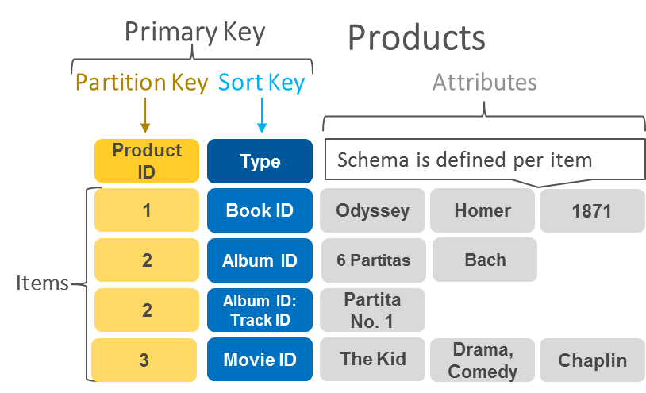

# NoSQL


## Relation databases history


### Relation databases history
Старт корабля «Восток-1» був проведений 12 квітня 1961 о 09:07 за московським часом з космодрому Байконур. Через чотирнадцять хвилин Гагарін, використовуючи свій позивний «Кедр», доповів про настання стану невагомості.


### Relation databases history
Програма «Аполлон» - програма пілотованих космічних польотів космічного агентства США НАСА, прийнята в 1961 році з метою здійснення першої пілотованої висадки на Місяць і завершена в 1975 році. Президент Джон Ф. Кеннеді сформулював завдання в своїй промові [1] 12 вересня 1961 року, що і вона була вирішена 20 липня 1969 року о ході польоту «Аполлон-11» висадкою Ніла Армстронга і Базза Олдрина.


### Relation databases history
IBM спроектувала IMS у співпраці з компаніями Rockwell і Caterpillar для космічної програми Аполлон в 1966 році. У завдання IMS входила обробка специфікації вироби (англ. Bill of materials) для ракети Сатурн-5 і кораблів Аполлон.

Датою випуску системи вважається 14 серпня 1968 року.


### Relation databases history
Особливості IBM IMS:
- Ієрархічна модель даних
- Структури даних вибаються користувачем
- Запити на мові програмування


### Relation databases history


### Relation databases history
CODASYL (англ. COnference on DAta SYstems Language - «Конференція по мовам систем обробки даних») - організація, яка брала активну участь в еволюції інформаційних технологій в 60-80-і роки XX століття. Заснована в 1959 для розробки стандартного мови програмування для комерційних систем. Ця мова отримав назву COBOL.


### Relation databases history
Програмісти COBOL запропонували стандарт, доступу до бази даних:
- Мережева модель
- Запити на мові програмування


### Relation databases history


### Relation databases history
Едгар Франк «Тед» Кодд (23 серпня 1923 — 18 квітня 2003) — британський дослідник в галузі інформатики, який, працюючи у IBM, винайшов, окрім іншого, реляційну модель даних для керування базами даних, теоретичну основу для реляційних баз даних. 

Написав наукову працю під назвою [«Реляційна модель даних для великих спільних обсягів даних»](https://www.seas.upenn.edu/~zives/03f/cis550/codd.pdf) (англ. "A Relational Model of Data for Large Shared Data Banks")


### Relation databases history
Реляційна алгебра базується на теорії множин і є основою логіки роботи баз даних.

**Реляційною базою даних** називається сукупність відносин, що містять всю інформацію, яка повинна зберігатися в базі.


### Relation databases history
- Відношення r на колекції(домена колекція) $D_1, D_2,...D_n$ - це підмножина декартового добутку $D_1 * D_2 X...X D_n$
- Нехай доно:
    - Studid = {412, 307}
    - StudName = {Alex, John}

|StudId|StudName|
|-|-|
|412|Alex|
|307|John|


### Relation databases history


### Relation databases history


### Relation databases history
Перві імплементації:
- System R - IBM Research
- INGRES - U.C.Berkeley
- Oracle - Larry Ellison


### Relation databases history
**Smalltalk** (вимовляється [смо́лток]) — об'єктно-орієнтована мова програмування з динамічною типізацією, розроблена в Xerox PARC Аланом Кейем, Деном Інгаллсом, Тедом Кеглером, Адель Голдберг в 1970-х роках.

**C++** виник на початку 1980-х років, коли співробітник фірми Bell Labs Бйорн Страуструп придумав ряд удосконалень до мови C під власні потреби.


### Relation databases history
В 1980-х починають виникати об'єктно реляційні бази даних, які дозволяють усунути несумісність схем.

Недоліки:
- Складні запити
- Немає стандарних API


## ACID


### ACID
В інформатиці акронім **ACID** описує вимоги до транзакційної системі (наприклад, до СУБД), що забезпечують найбільш надійний і передбачуваний хід роботу.
ACID:
- Atomicity
- Consistency
- Isolation
- Durability


### ACID - atomicity
Атомарність гарантує, що ніяка транзакція не буде зафіксована в системі частково. Будуть або виконані всі її подоперации, або не виконано жодної.


### ACID - consistency
Транзакція, що досягає свого нормального завершення (EOT - end of transaction, завершення транзакції) і, тим самим, яка фіксує свої результати, зберігає узгодженість бази даних. Іншими словами, кожна успішна транзакція по визначенню фіксує тільки допустимі результати.


### ACID - isolation
Під час виконання транзакції паралельні транзакції не повинні впливати на її результат. Ізольованість - вимога дорога, тому в реальних БД існують режими, які не повністю ізолюють транзакцію (рівні ізольованості)


### ACID - durability
Незалежно від проблем на нижніх рівнях (наприклад, знеструмлення системи або збої в обладнанні) зміни, зроблені успішно завершеною транзакцією, повинні залишитися збереженими після повернення системи в роботу. Іншими словами, якщо користувач отримав підтвердження від системи, що транзакція виконана, він може бути впевнений, що зроблені ним зміни не будуть скасовані через будь-якого збою.


## Shards Attack


### Shards Attack


### Shards Attack


### Shards Attack


### Shards Attack


### Shards Attack


## NoSQL


### NoSQL
Чим цікаві бази NoSQL:
- Продуктивність роботи: не потрібо витрачати час на приведення даних із несумісних структур. Бази NoSQL можуть забезпечити більш підходящу модель.
- Великі дані: NoSQL з'явився у відповідь на необходімосrь обробляти більші обсяги даних, яка змушує нас зробити фундаментальні зміни в сторону побудови  кластерів


### NoSQL
Іронія долі полягає в тому, що термін "NoSQL" вперше з'явився в кінці 1990-х років в якості назви реляційної бази даних з відкритим джерельним кодом [Strozzi NoSQL].
- Сберігає кортежі в файлах, розділених табуляцією
- Не використовує SQL


### NoSQL
- Народження терміна "NoSQL" в сучасному сенсі датується 11 червеням 2009 року.
- Він з'явився на конференції в Сан-Франциско, яку організував Йохан Оскарссон.
- Йохану потрібно було ім'я для свого семінару - що-небудь на зразок хеш-тега. 
- Він звернувся за допомогою в інтернет чат \#cassandra і отримав кілька варіантів, з яких вибрав "NoSQL"


### NoSQL
Термін "NoSQL" прижився, але ніколи не мав строгого визначення.


### NoSQL
Основні характеристики NoSQl - баз даних:
- Відмова використання реляційної моделі
- Ефективна робота на кластерах
- Відкритий джерельний код
- Врахування можливостей сучасних мереж
- Відсутність структури


### NoSQL
Головним наслідком появи технології NoSQL є мультиперсистентність(Polyglot Persistence).


### NoSQL
Однією з основних особливостей технології NoSQL є відмова від реляційної моделі. NoSQL використовує свої власні моделі. Ці моделі поділяються на чотири категорії:
- ключ-значення
- документ
- сімейство стовпців
- граф.


### NoSQL
Перші три моделі мають загальну властивість, яку ми назвемо **агрегатною орієнтацією** (Aggregate orientation).


### NoSQL
Реляційна модель отримує інформацію, яку ми хочемо зберігати, і розділяєїї на кортежі (рядки). Кортеж - це обмежена структура даних. вона зберігає набір значень, тому не може містити запис, список значень або інший кортеж. Ця простота утворює основу реляційної моделі і дозволяє інтерпретувати всі операції як операції над кортежами і повернення кортежів.


### NoSQL
Агрегатна орієнтація дотримується іншого підходу. Вона враховує необність оперувати даними, що мають більш складну структуру, ніж набір кортежів. Її можна описати в термінах складного записи, який може містити списки і інші структури записів.


### NoSQL
- **Агрегат** - це термін, що прийшов з предметно-орієнтованого проектування. У предметно-орієнтованому проектуванні агрегатом називають колекцію пов'язаних об'єктів, яка інтерпретується як єдине ціле.

- Зокрема, вона являє собою одиницю для маніпулювання даними тауправління їх узгодженісттю.


### NoSQL


### NoSQL


### NoSQL


## Модель ключ - значення


### Модель ключ-значення
База даних на основі пар «ключ-значення» - це тип нереляційних баз даних, в якому для зберігання даних використовується простий метод «ключ-значення». База даних на основі пар «ключ-значення» зберігає дані як сукупність пар «ключ-значення», в яких ключ є унікальним ідентифікатором. Як ключі, так і значення можуть бути чим завгодно: від простих до складних складових об'єктів.


### Модель ключ-значення



### Модель ключ-значення
Приклади використання:
- Зберігання сесії в розподіленій системі
- Відмовостійка корзина інтернет магазину


## Документо - орієнтована модель


### Документо - орієнтована модель
Документо - орієнтовані  СУБД (англ. Document-oriented database) - СУБД, спеціально призначена для зберігання ієрархічних структур даних (документів) і зазвичай реалізована за допомогою підходу NoSQL. В основі документоорієнтованих СУБД лежать документні сховища (англ. Document store), що мають структуру дерева (іноді лісу). Структура дерева починається з кореневого вузла і може містити кілька внутрішніх і листових вузлів.


### Документо - орієнтована модель


### Документо - орієнтована модель
Якщо абстрагуватися від таких «дрібниць» як продуктивність, масштабованість і надійність, то Д (окументно) О (орієнтовані) СУБД і О (об'єктно) О (орієнтовані) СУБД в багатьох випадках дозволяють розробнику відображати сутність предметної області на сутності БД без введення додаткових сутностей :), які доводиться вводити в Р (еляціонних) СУБД.


### Документо - орієнтована модель VS key-value
Ці дві моделі відрізняються один від одного тим, що в базі даних "ключ значення "агрегат є непроникним для бази даних - просто великий чорний ящик, що складається з переважно безглуздих бітів.


## Модель сімейство колонок


### Модель сімейство колонок
Давайте для початку поглянемо на будівельні блоки, перед тим, як побачимо, як вони всі можуть працювати разом.


### Стовпець
Стовпець (Column) - це мінімальний елемент даних. Це триплет, що містить ім'я, значення і мітку часу. Стовпець, представлений в позначеннях JSON:
```json
{
  name: "emailAddress",
  value: "arin@example.com",
  timestamp: 123456789
}
```


### Суперстовпець
Суперстолбец (SuperColumn) - це сукупність бінарного імені і значення, яке по суті є таблицею, що містить необмежену кількість стовпців, з ключем - ім'ям стовпця.

```json
{
  name: "homeAddress",
  value: {
    street: {name: "street", value: "1234 x street", timestamp: 123456789},
    city: {name: "city", value: "san francisco", timestamp: 123456789},
    zip: {name: "zip", value: "94107", timestamp: 123456789},
  }
}
```


### Складаєм во єдино


## Графова база даних


### Графова БД
Графові бази даних - білі ворони в зграї баз даних NoSQL. NoSQL з'явилися на вимогу працювати на кластерах, яка привела до аrреrатно-орієнтованим моделям великих записів з простими зв'язками. Графові бази даних з'явилися як рішення друrой проблеми і тому мають протилежну модель - маленькі записи зі складними зв'язками.


### Графова БД


### Графова БД


### Графова БД


## CAP - теорема


### CAP - теорема
**Теорема CAP** (також відома як теорема Брюера, на честь науковця Еріка Брюера) — твердження, що для будь-якої розподіленої комп'ютерної системи неможливо одночасно забезпечити виконання більше двох із перелічених трьох властивостей:
- узгодженість даних (усі вузли бачать однакові дані у будь-який момент часу);
- доступність (гарантія того, що кожен запит отримає коректну відповідь);
- стійкість до розділення (попри розділення на ізольовані секції або втрати зв'язку з частиною вузлів, система не втрачає стабільність і здатність коректно відповідати на запити).


### CAP - теорема


### Рекомендована література
