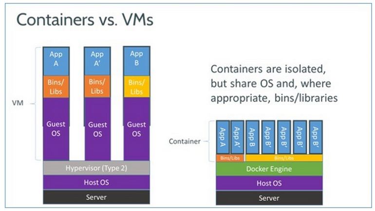
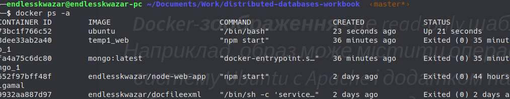
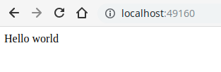

# Docker

# Зміст

${toc}

# Що таке Docker?

> **Docker** — інструментарій для управління ізольованими Linux-контейнерами. Docker доповнює інструментарій LXC більш високорівневим API, що дозволяє керувати контейнерами на рівні ізоляції окремих процесів.

> **Docker** - це відкрита платформа для розробки, доставлення та експлуатації додатків.


# Для чого може знадобитися Docker?

Платформа і засоби контейнерної віртуалізації можуть бути корисні в таких випадках:

- пакування вашого застосунку (і так само використовуваних компонентів) в docker контейнери;
- роздача і доставлення цих контейнерів вашим командам для розробки та тестування;
- викладання цих контейнерів в продакшн, як в дата-центри так і в хмари.

# Відмінність від віртуалізації

Спочатку віртуалізація була покликана позбавити від подібних проблем, але в ній є суттєві недоліки:

- повільне завантаження;
- можлива плата за надання додаткового простору;
- не всі віртуальні машини (VM) підтримують сумісне використання;
- підтримують VM часто вимагають складної настройки;
- образ може бути занадто великим, тому, що «додаткова ОС» додає гігабайт простору в проєкт поверх операційної системи, а в більшості випадків на сервер ставиться кілька VM, які займають ще більше місця



# Платформи

Докер працює не тільки на його рідній ОС, Linux, але також підтримується Windows і macOS. Єдина відмінність від взаємодії з Linux в тому, що на macOS і Windows платформа інкапсулюється в крихітну віртуальну машину. На даний момент Докер для macOS і Windows досяг значного рівня зручності у використанні.

Крім того, існує безліч додаткових додатків, таких як Kitematic або Docker Machine, які допомагають встановлювати та використовувати Docker на платформах, відмінних від Linux.

# Установка Docker на Windows

Перейдіть на сайт [https://www.docker.com](https://www.docker.com):


З розділу Products виберіть Docker Engine. Нас цікавить Docker Engine Comminity:


У новій вкладці Docker Hub виберіть Docker Desktop for Windows:


Щоб мати змогу завантажити Docker потрібно ввійти або створити обліковий запис в Docker Hub(це безкоштовно). Після цього стане доступна кнопка Get Docker:


Запустіть скачаний файл і установіть Docker залишивши всі параметри за замовчуванням після цього перезайдіть в систему:


Після того як Ви перезайшли в систему Docker спробує запуститися. Тут існує доволі велика імовірність того, що це не вдасться. Річ у тому, що Docker потребує для своєї роботи Hyper-V, який за замовчуванням вимкнений в операційній системі Windows. Docker видасть повідомлення про те, що Hyper-V не ввімкнено і запропонує це зробити. Натискаємо Ok, після чого система перезавантажиться.


Після перезавантаження Docker повинен успішно запуститися:


Для перевірки роботоспособності Docker відкрийте Power Shell і виконайте команду:

```bash
docker -v
```


## Налаштування Docker на Windows

Після встановлення Docker він буде автоматично запускатися при старті системи, але це не завжди прийнятні варіанти. Вимкнути автостарт Docker можна в налаштуваннях:


За замовчуванням Docker намагатиметься взяти половину можливих ресурсів хостової операційної системи. Цю поведінку також можна змінити в налаштуваннях:


# Основні терміни, при роботі з Docker`ом

Щоб розуміти, з чого складається docker, вам потрібно знати про три компоненти:

- зображення (images)
- реєстр (registries)
- контейнери

## Зоображення (images)

> **Docker-зображення** - це read-only шаблон. Наприклад, образ може містити операційну систему Ubuntu c Apache і додатком на ній. Образи використовуються для створення контейнерів. Docker дозволяє легко створювати нові образи, оновлювати існуючі, або ви можете завантажити образи створені іншими людьми. Образи — це компонента збірки docker-а.

## Реєстр (registries)

> **Docker-реєстр** зберігає зображення. Є публічні та приватні реєстри, з яких можна звантажити або завантажити образи. Публічний Docker-реєстр - це Docker Hub. Там зберігається величезна колекція образів. Як ви знаєте, образи можуть бути створені вами або ви можете використовувати образи створені іншими. Реєстри — це компонента поширення.

## Контейнери

> **Контейнери** схожі на директорії. У контейнерах міститься все, що потрібно для роботи програми. Кожен контейнер створюється з образу. Контейнери можуть бути створені, запущені, зупинені, перенесені або видалені. Кожен контейнер ізольований і є безпечною платформою для додатка. Контейнери — це компонента роботи.

# Docker Hello World example

```bash
$ docker run hello-world
```

Ця команда завантажить образ Docker hello-world з Dockerhub, якщо він вже не присутній, і запустити його. Як наслідок, ви побачите наведений нижче вивід:

```
Hello from Docker!
This message shows that your installation appears to be working correctly.

To generate this message, Docker took the following steps:
 1. The Docker client contacted the Docker daemon.
 2. The Docker daemon pulled the "hello-world" image from the Docker Hub.
    (amd64)
 3. The Docker daemon created a new container from that image which runs the
    executable that produces the output you are currently reading.
 4. The Docker daemon streamed that output to the Docker client, which sent it
    to your terminal.

To try something more ambitious, you can run an Ubuntu container with:
 $ docker run -it ubuntu bash

Share images, automate workflows, and more with a free Docker ID:
 https://hub.docker.com/

For more examples and ideas, visit:
https://docs.docker.com/get-started/
```

# Docker Ubuntu bash example. Імена контейнерів

```bash
$ docker run -ti ubuntu
```


В результаті ми отримаємо дієспроможну систему Ubuntu, в якій запущений bash. Всі команди, які ми почнемо зараз вводити будуть виконуватися на Ubuntu. Наприклад, виконаймо команду ls:

```bash
$ ls
```


> ls - виводить інформацію про файли в каталозі

Створім новий файл в каталозі home:

```bash
$ cd home
$ touch hello.txt
$ ls
```

> cd - зміна робочої директорії
> 
> Команда touch (1) використовується для зміни тимчасової мітки файлу. За допомогою цієї команди ви можете змінювати час доступу до файлу і час його зміни. Якщо вказаний файл не існує, touch створить файл нульового розміру з вказаним ім'ям.


Тепер зупинимо контейнер, для чого можна натиснути комбінацію клавіш CTRL + D, або виконавши команду exit:


Запустимо контейнер заново і спробуємо знайти файл, який ми створили раніше:

```bash
$ docker run -ti ubuntu
$ ls
$ cd home
$ ls
```


Файл hello.txt відсутній. Річ у тому, що ми запустили два різних контейнерів на основі зображення Ubuntu:

```bash
$ docker container ls -a
```

> docker container ls -a - виводить список всіх контейнерів


Кожному контейнеру було дано випадкове значення CONTAINER ID. Ми можемо використати це значення для того, щоб запустити потрібний нам контейнер:

```bash
$ docker start -i 418
$ cd home
$ ls
```

> docker start - запуск існуючого контейнера


Зверніть увагу, що працюючи з CONTAINER ID не обов'язково прописувати його повністю, достатньо вказати мінімальну його частину для однозначної ідентифікації.

Існують ситуації, що варіант із випадковим ідентифікатором нас не влаштовують, для цього docker передбачає можливість вказати ім'я контейнера.

```bash
$ docker run -ti --name=my_ubuntu ubuntu
```

> --name - параметр, який дозволяє задати ім'я для контейнера


Запустити контейнер my_ubuntu можна командою:

```bash
$ docker start -i my_ubuntu
```


# Detached/Atached

Під час запуску контейнера необхідно спочатку вирішити, чи потрібно запустити контейнер у фоновому режимі(detached mode) або в режимі переднього плану за замовчуванням. Ви можете використовувати detached mode, якщо ви хочете, щоб контейнер виконувався, але не хочете переглядати та слідувати за всім його виведенням.

Часто ви побачите коротку версію опції detach, що використовується, -d, а довша версія --detach:

```bash
$ docker run -d IMAGE
```

Спробуємо запустити Ubuntu в detached mode:

```bash
$ docker run -d -i --name=d_ubuntu ubuntu
```


На відміну від попередніх прикладів зараз ми не можемо вводити команди в термінал, щойно запущеної Ubuntu.

## Docker ps

Після запуску контейнерів у відключеному режимі ви можете переглядати їх, використовуючи командну панель керування командами CLI docker ps.

За замовчуванням в ньому перелічено запущені контейнери. Деякі корисні варіанти включають:

- -a/-all список всіх контейнерів

```bash
$ docker ps -a
```



## Docker exec

exec - запускає команду в активному контейнері.

```bash
docker exec [OPTIONS] CONTAINER COMMAND [ARG...]
```

Для того щоб запустити команду, наприклад bash у контейнері d_ubuntu достатньо виконати команду:

```bash
docker exec -it d_ubunt bash
```


# Node.js single script example

Створіть директорію і в ній файл index.js:


Вміст файлу index.js:

```js
console.log("Hello from node in Docker!!!");
```

Для того щоб запустити файл index.js на Node.js можна наступною командою:

```bash
$ docker run -it --rm --name my-running-script -v "$PWD":/usr/src/app -w /usr/src/app node:8 node index.js
```

> **--rm** - видаляє зупинений контейнер
>
> **-v** - Том — це спеціально призначений каталог у межах одного або декількох контейнерів, який обходить файлову систему Union.
>
> **node index.js** - команда, яка буде виконана в контейнері


# Node.js example port mapping

Модифікуємо index.js наступним чином:

```js
const http = require('http');
const port = 3000;

const requestHandler = (request, response) => {
    console.log(request.url);
    response.end('Hello Node.js Server!');
}

const server = http.createServer(requestHandler);

server.listen(port, (err) => {
    if (err) {
        return console.log('something bad happened', err)
    }
    console.log(`server is listening on ${port}`)
})
```

Запустимо скрипт вже відомою нам командою:

```bash
$ docker run -it --rm --name my-running-script -v "$PWD":/usr/src/app -w /usr/src/app node:8 node index.js
```

В результаті ми отримаємо повідомлення, що сервер успішно запущений і слухає порт - 3000:


Спробуємо відкрити адресу localhost:3000. Як результат ми отримаємо помилку:


За замовчуванням, коли ви створюєте контейнер, він не публікує жоден зі своїх портів у зовнішній світ. Щоб зробити порт доступним для служб за межами Docker, або до контейнерів Docker, які не підключені до мережі контейнера, використовуйте параметр --publish або -p. Це створює правило брандмауера, який показує порт контейнера до порту на хості Docker. Ось кілька прикладів.

|Параметр|Пояснення|
|-|-|
|-p 8080:80|Зв'язує порт TCP 80 у контейнері до порту 8080 на хості Docker.|
|-p 192.168.1.100:8080:80|Зв'язує TCP-порт 80 у контейнері до порту 8080 на хості Docker для підключення до IP-адреси 192.168.1.100.|
|-p 8080:80/udp|Зв'язує UDP-порт 80 у контейнері на порт 8080 на хості Docker.|

Модифікуємо команду запуску контейнера, включивши до нього команду для зв'язання порту:

```bash
$ docker run -it --rm --name my-running-script -v "$PWD":/usr/src/app -w /usr/src/app -p 3000:3000 node:8 node index.js
```


# Dockerfile

Dockerfile містить набір інструкцій з аргументами. Кожна інструкція пишеться великими літерами (наприклад FROM). Інструкції обробляються зверху вниз. Кожна інструкція додає новий шар в образ і зберігає зміни. Docker виконує інструкції, дотримуючись процесу:
- Запуск контейнера з образу
- Виконання інструкції та внесення змін до контейнера
- Запуск еквівалента docker commit для запису змін в новий шар образу
- Запуск нового контейнера з нового образу
- Виконання наступної інструкції в файлі та повторення кроків процесу.

Це означає, що якщо виконання Dockerfile зупиниться з якоїсь причини (наприклад інструкція не зможе завершитися), ви зможете використовувати образ до цієї стадії. Це дуже корисно при налагодженні: ви можете запустити контейнер з образу інтерактивно і дізнатися, чому інструкція не виконалася, використовуючи останній створений образ.

Також Dockerfile підтримує коментарі. Кожен рядок, що починається з # означає коментар.

## Ubuntu/NGINX Dockerfile

Додамо в Dockerfile інформацію з побудови образу:

```
# Version: 0.0.1
FROM ubuntu:14.04
MAINTAINER endlesskwazar <endlesskwazar@gmail.com>
RUN apt-get update
RUN apt-get install -y nginx
RUN echo 'Hi, I am in your container' \
        >/usr/share/nginx/html/index.html
ENTRYPOINT service nginx restart && bash
EXPOSE 80
```

- Перша інструкція в Dockerfile завжди повинна бути FROM, яка вказує, з якого базового образу потрібно побудувати наший. У нашому прикладі ми будуємо образ з базового образу ubuntu версії 14:04.
- Далі ми вказуємо інструкцію MAINTAINER, що повідомляє Docker про автора образу і його email. Це корисно, щоб користувачі образу могли зв'язатися з автором при необхідності.
- Інструкція RUN виконує команду в конкретному образі. У нашому прикладі за допомогою її ми оновлюємо APT репозиторії і встановлюємо пакет з NGINX, потім створюємо файл /usr/share/nginx/html/index.html.
- Інструкція ENTRYPOINT вказує, яку команду необхідно запустити, коли контейнер запущений. На відміну від команди RUN зазначена команда виконується не під час побудови образу, а під час запуску контейнера.
- Далі ми вказуємо інструкцію EXPOSE, яка говорить Docker, що додаток в контейнері повинен використовувати певний порт в контейнері. Це не означає, що ви можете автоматично отримувати доступ до сервісу, запущеного на порту контейнера (в нашому прикладі порт 80). З міркувань безпеки Docker не відчиняє порт автоматично, але очікує, коли це зробить користувач в команді docker run. Ви можете вказати безліч інструкцій EXPOSE для вказівки, які порти повинні бути відкриті. Також інструкція EXPOSE корисна для передачі портів між контейнерами.

Для того щоб побудувати зображення потрібно використати команду:

```cpp
docker build -t endlesskwazar/docfileexml .
```


Тепер запустимо зоображення командою:

```bash
docker container run -it -p 80:80 --name=my-image endlesskwazar/docfileexml
```


## Node.js Dockerfile example

Клонуйте репозиторій https://github.com/endlesskwazar/distributed-databases-examples.git. Перейдіть на гілку example1.

Для того щоб побудувати зображення виконайте команду:

```
docker build -t <your username>/node-web-app .
```

Для того щоб запустити контейнер виконайте команду:

```
docker run -p 49160:8080 -d <your username>/node-web-app
```

Перейдіть за адресою localhost:49160




## Включення локальних файлів в зоображення. COPY VS ADD

В одному із минулих прикладів, ми створювали новий файл всередині контейнера, але часто існує потреба передати файли із хостової операційної системи в контейнер. Для цієї задачі в docker існують два способи:

- COPY
- ADD

### COPY

> COPY - копіює один або декілька локальних файлів або папок у пункт призначення у своєму зображенні Docker.

```bash
COPY <source>... <destination>
COPY ["<source>",... "<destination>"]
```

### ADD

Ця інструкція має подібний синтаксис до COPY.

```bash
ADD <source>... <destination>
ADD ["<source>",... "<destination>"]
```

Окрім копіювання локальних файлів і каталогів у пункт призначення на зображенні Docker, він має деякі додаткові функції:
- Якщо &lt;source&gt; є локальним архівом tar у розпізнаному форматі стиснення, то він автоматично розпаковується у вигляді каталогу до зображення Docker. Наприклад: ADD rootfs.tar.xz /
- Якщо &lt;source&gt; є URL-адресою, то він завантажуватиме та копіюватиме файл у пункті призначення, розташованого на зображенні Docker. Однак Docker не рекомендує використовувати ADD для цієї мети.

# Docker compose

> **Docker-compose** це простий інструмент, який дозволяє налаштувати і запустити кілька контейнерів однією командою.

Вся конфігурація для docker-compose описується в файлі docker-compose.yml, який зазвичай лежить в корені проекту.


В прикладі ми будемо використовувати ["monorepo"](https://cacm.acm.org/magazines/2016/7/204032-why-google-stores-billions-of-lines-of-code-in-a-single-repository/fulltext). Код кожного сервісу (frontend, api, worker, etc) знаходиться в своїй директорії і має Dockerfile. Приклад структури проекту можна подивитися [тут](https://github.com/auxilincom/docker-compose-starter).

## Node.Js, MongoDB, React

Створемо нову директорію api, в ній ініціалізуємо новий node - проект, використавши команду:

```bash
npm init
```

Встановимо залежності для проекту:

```bash
npm i mongoose express nodemon mongodb cors
```

Створимо файл index.js з наступним вмістом:

```js
const express = require("express");
const cors = require('cors');
const mongoose = require('mongoose');
const http = require('http');

mongoose.connect(process.env.MONGO_URL, {useNewUrlParser: true});

const Wish = new mongoose.model('Wish', new mongoose.Schema({
    title: String
}));

const app = express();
app.use(express.json());
app.use(cors());

app.post('/api/wishes', async (req, res) => {
    console.log(req.body);
    const {title} = req.body;
    try {
        const wish = await Wish.create({title});
        return res.json(wish);
    }
    catch(e) {
        res.status(400).send(e);
    }
});

app.get('/api/wishes', async (req, res) => {
    try {
        const wishes = await Wish.find();
        return res.send(wishes);
    }
    catch(e) {
        res.status(400).send(e);
    }
});

http.createServer(app).listen(process.env.API_PORT, () => {
    console.log('Api server is started');
});
```

В package,json створимо скрипт для запуску додатку:

```json
{
  "name": "api",
  "version": "1.0.0",
  "description": "",
  "main": "index.js",
  "scripts": {
    "test": "echo \"Error: no test specified\" && exit 1",
    "dev": "nodemon index.js"
  },
  "author": "",
  "license": "ISC",
  "dependencies": {
    "cors": "^2.8.5",
    "express": "^4.17.1",
    "mongodb": "^3.5.2",
    "mongoose": "^5.8.11",
    "nodemon": "^2.0.2"
  }
}
```

Створимо в тій же директорії файл Dockerfile.dev:
```
from node:12
WORKDIR /usr/src/app
COPY package*.json ./
RUN npm install
COPY . .
EXPOSE ${API_PORT}
CMD [ "npm", "run", "dev"]
```

- WORKDIR /usr/src/app - створюємо директорію в контейнері й робимо її активною
- COPY package*.json ./ - копіюємо package.json в директорію контейнера
- RUN npm install - інсталюємо залежності
- COPY . . - копіюємо весь додаток в контейнер
- EXPOSE ${API_PORT} - виставляємо порт для прослуховування
- CMD [ "npm", "run", "dev"] - запускаємо команду в контейнері

Створимо файл .dockerignore він допоможе не уопіювати зайві файли:

```
node_modules
npm-debug.log
```

Повернемося в корневу директорію. На одну ієрархію вище api. Створимо файл .env в ноьому буде зберігатися конфігурація.

```
MONGO_URL=mongodb://mongo:27017/wish
API_PORT=3001
```

Створимо файл docker-compose.dev.yml:

```yml
version: '3'

services:
  api:
    build:
      context: ./api
      dockerfile: Dockerfile.dev
    image: wish-api-dev
    volumes:
      - ./api:/usr/src/app
      - /api/node_modules
    ports:
      - ${API_PORT}:${API_PORT}
    environment:
      - MONGO_URL=${MONGO_URL}
      - API_PORT=${API_PORT}
    depends_on:
      - mongo
  mongo:
    image: mongo
    volumes:
      - ./data/dev:/data/db
    ports:
      - "27017:27017"
```

- services: - перелік сервісів
- build - секція конфігурації будування зображення
- context - робоча директорія із якої буде вестися будування
- dockerfile - назва docker - файлу згідно із якого будується зображення
- image - назва побудованого зображення
- volumes - перелік мапінга локальних і директорій в контейнері
- ports - виставлення порту контейнера на поверхню
- environment - передача змінних в контейнер
- depends_on - api залежить від БД. Чекати із запуском контейнера, доки не буде запущена база.


Щоб запустити проект, нам знадобитися одна команда:

```bash
docker-compose -f docker-compose.dev.yml up --build
```

При першому старті, всі контейнери будуть побудовані або завантажені. Перевіримо роботоспроможність додатку:


Перейдемо в корінь проекту і виконайємо команду:

```bash
npx create-react-app client
```

Модифікуємо файл client/App.js:

```js
import React from 'react';

class App extends React.Component {

  constructor() {
    super();
    this.API_BASE = 'http://localhost:3001/api/wishes';
    this.state = {
      wishes: [],
      newWish: null
    }
  }

  onChange = (e) => {
    const text = e.target.value;
    const newWish = { title: text };
    this.setState({ newWish });
  }

  onSubmit = (e) => {
    e.preventDefault();
    fetch(this.API_BASE, {
      method: 'POST',
      headers: {
        'Content-Type': 'application/json',
      },
      body: JSON.stringify(this.state.newWish)
    })
      .then(res => this.updateWishesList())
      .catch(e => console.log(e));
  }

  componentDidMount() {
    this.updateWishesList();
  }

  updateWishesList = () => {
    fetch(this.API_BASE)
      .then(res => res.json())
      .then(json => {
        this.setState({
          wishes: json
        });
      })
      .catch(e => console.log(e));
  }

  render() {
    const { wishes } = this.state;
    const wishesItems = wishes.map(wish => {
      return <WishItem key={wish._id} wish={wish} />
    });

    return (
      <div>
        <h1>Wish App</h1>
        <div>
          <AddWishForm onChange={this.onChange} onSubmit={this.onSubmit} />
        </div>
        <hr />
        <ul>
          {wishesItems}
        </ul>
      </div>
    );
  }

}

function WishItem({ wish }) {
  return (
    <li>{wish.title}</li>
  );
}

function AddWishForm({ onChange, onSubmit }) {

  return (
    <div>
      <form onSubmit={onSubmit}>
        <input type="text" onChange={onChange} />
        <input type="submit" />
      </form>
    </div>
  );
}

export default App;
```

Створимо файли Dockerfile.dev і .dockerignore в директорії client:

Dockerfile.dev:
```
from node:12
WORKDIR /usr/src/app
COPY package*.json ./
RUN npm install
COPY . .
EXPOSE 3000
CMD [ "npm", "start"]
```

.gitignore
```
node_modules
npm-debug.log
```

Модифікуємо файл docker-compose.dev.yml:
```yml
version: '3'

services:
  api:
    build:
      context: ./api
      dockerfile: Dockerfile.dev
    image: wish-api-dev
    volumes:
      - ./api:/usr/src/app
      - /api/node_modules
    ports:
      - ${API_PORT}:${API_PORT}
    environment:
      - MONGO_URL=${MONGO_URL}
      - API_PORT=${API_PORT}
    depends_on:
      - mongo
  client:
    build:
      context: ./client
      dockerfile: Dockerfile.dev
    image: wish-client-dev
    volumes:
      - ./client:/usr/src/app
      - /api/node_modules
    ports:
      - 3000:3000
    depends_on:
      - api
  mongo:
    image: mongo
    volumes:
      - ./data/dev:/data/db
    ports:
      - "27017:27017"
```

Щоб запустити проект, нам знадобитися одна команда:

```bash
docker-compose -f docker-compose.dev.yml up --build
```


Приклад проекту можна подивитися на **https://github.com/endlesskwazar/distributed-databases-examples**. Гілка **docker-compose-node-mongo-react**.


## Завжди використовуйте --build

За замовчуванням, docker-compose up не буде перебудовувати контейнери, якщо вони вже є на хості. Щоб змусити докер робити це, потрібно використовувати аргумент --build. Зазвичай це потрібно, коли сторонні залежності проекту змінюються або змінюється докерфайл. В нашій команді ми завжди використовуємо docker-compose up --build. Docker вміє кешувати шари та не буде перебудовувати контейнера, якщо нічого не змінилося. При використанні --build повсюдно, ви, можливо, втратите кілька секунд при старті програми. Але, при цьому ви ніколи не зіштовхнетеся з магічними проблемами запуску нової версії додатка зі старими залежностями.

**Порада**: Ви можете обернути команду запуску проект в простий баш скрипт:

```sh
#!/bin/sh
docker-compose up --build "$@"
```

# Домашнє завдання

Використовуючи Docker Compose створіть середовище розробки для застосунку на PHP, який використовує MySQL. Проєкт завантажити на репозиторій(гілка lb1). Додати користувача endlesskwazar@gmail.com до репозиторію.

# Контрольні запитання

1. Що таке Docker? Наведіть області його застосування.
2. Чим образи відрізняються від контейнерів?
3. Що таке Dockerfile. Перелічіть, що в ньому може бути написане.
4. Чим COPY відрізняється від ADD?
5. Що таке Docker - compose?
