# Load balancing

${toc}

# NGINX

**NGINX [engine x]** - це HTTP-сервер і зворотній проксі-сервер, поштовий проксі-сервер, а також TCP / UDP проксі-сервер загального призначення, спочатку написаний Ігорем Сисоєвим. Уже тривалий час він обслуговує сервери багатьох високонавантажених сайтів.

Згідно зі статистикою Netcraft nginx обслуговував або проксював 25.44% самих навантажених сайтів в січні 2020 року.

Практичне застосування NGINX:
- При наявності великої кількості статичного контенту або файлів для завантаження, можна налаштувати на окремому порту або IP, щоб здійснювати роздачу. При великій кількості запитів рекомендується ставити окремий сервер і підключати до нього Nginx.
- Балансування навантаження
- Стрімінг
- API gateway

На відміну від звичайного веб-сервера, Nginx не створює один потік під кожен запит, а розділяє його на менші однотипні структури, звані робочими з'єднаннями. Кожне таке з'єднання обробляється окремим робочим процесом, а після виконання вони зливаються в єдиний блок, який повертає результат в основний процес обробки даних. Одне робоче з'єднання може обробляти до 1024 запитів одного виду одночасно.

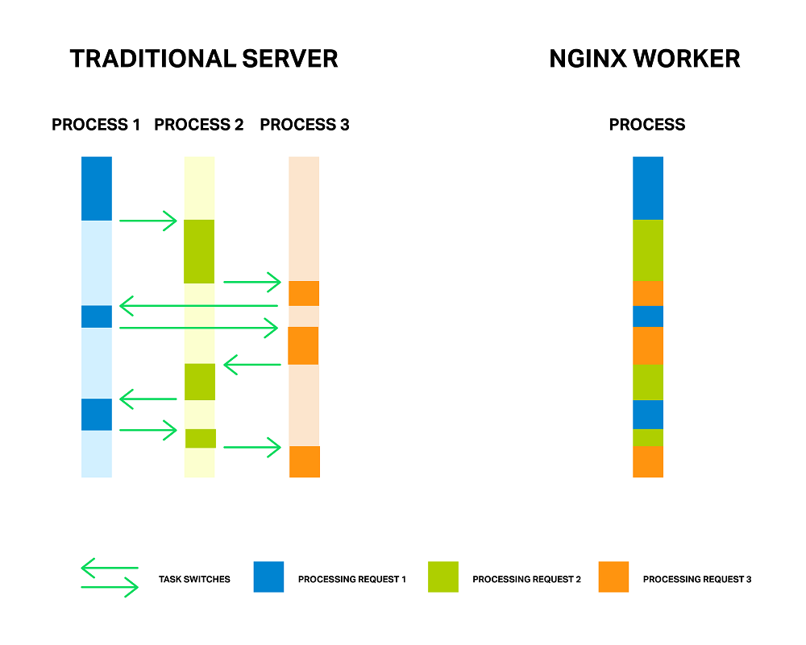


## NGINX vs Apache

Веб-сервер Nginx в порівнянні з Apache працює швидше при віддачі статики й споживає менше серверних ресурсів. Його використовує замість або разом з Apache для прискорення обробки запитів і зменшення навантаження. Це обумовлюється тим, що більша частина тих можливостей, які пропонує Apache, більшості звичайних користувачів не потрібно.

Оскільки широкий функціонал Nginx вимагає і значно більших ресурсів системи, постійно застосовувати повноцінну зв'язку «Nginx + Apache» недоцільно. Найчастіше обидва веб-сервери використовуються в симбіозі - Nginx віддає статику і перенаправляє обробку скриптів Apache.

# Конфігурація NGINX

NGINX використовує контексти конфігурації, які описані в різних файлах конфігурації. Базовий файл nginx.conf. Розташування цього файлу буде залежати від того, як ви встановили програмне забезпечення на свій комп'ютер. Для багатьох дистрибутивів файл буде знаходитися в /etc/nginx/nginx.conf. Якщо він там не існує, він також може знаходитися в /usr/local/nginx/conf/nginx.conf або /usr/local/etc/nginx/nginx.conf.

**Основний контекст**

Перше, що ви повинні помітити при перегляді основного файлу конфігурації, це те, що він виглядає організованим у вигляді дерева, визначеної наборами дужок (які виглядають як + {+ і +} +). Мовою Nginx області, які визначають ці дужки, називаються «контекстами», тому що вони містять деталі конфігурації, які розділені відповідно до галузі їх інтересів. По суті, ці підрозділи забезпечують організаційну структуру разом з деякою умовною логікою, щоб вирішити, чи застосовувати конфігурації всередині.

Оскільки контексти можуть бути нашаровані один на одного, Nginx забезпечує рівень успадкування директив. Як правило, якщо директива дійсна в декількох вкладених областях, оголошення в ширшому контексті буде передано будь-кому дочірньому контексту як значення за замовчуванням. Дочірні контексти можуть перевизначати ці значення за бажанням. Варто відзначити, що перевизначення будь-яких директив типу масиву replace попереднє значення, а не додається до нього.

Перша група контекстів, які ми обговоримо, — це основні контексти, які Nginx використовує для створення ієрархічного дерева і поділу проблем дискретних блоків конфігурації. Це контексти, які складають основну структуру конфігурації Nginx.

```
# The main context is here, outside any other contexts

. . .

{

   . . .

}
```

Кажуть, що будь-яка директива, яка існує повністю поза цих блоків, мешкає в «головному» контексті. Пам'ятайте, що якщо ваша конфігурація Nginx налаштована за модульним принципом, деякі файли будуть містити інструкції, які, мабуть, існують поза контекстом, укладеного у дужки, але які будуть включені в такий контекст, коли конфігурація зшита разом.

**Контекст подій**

Контекст «подій» міститься в «основному» контексті. Він використовується для установки глобальних параметрів, які впливають на те, як Nginx обробляє з'єднання на загальному рівні. У конфігурації Nginx може бути тільки один контекст подій.


```
# main context

events {

   # events context
   . . .

}
```

**HTTP - контекст**

Під час налаштування Nginx в якості веб-сервера або зворотного проксі-сервера контекст http буде містити більшу частину конфігурації. Цей контекст буде містити всі директиви та інші контексти, необхідні для визначення того, як програма буде обробляти з'єднання HTTP або HTTPS.

Контекст http є родинним контекстом подій, тому вони повинні бути перераховані поруч, а не вкладеними. Вони обидва діти основного контексту:

```
# main context

events {
   # events context

   . . .

}

http {
   # http context

   . . .

}
```

**Контекст сервера**

Контекст «сервера» оголошується в контексті «http». Це наш перший приклад вкладених контекстів. Це також перший контекст, який допускає кілька оголошень.

Загальний формат для контексту сервера може виглядати приблизно так. Пам'ятайте, що вони знаходяться в контексті http:

```
# main context

http {

   # http context

   server {

       # first server context

   }

   server {

       # second server context

   }

}
```

Причиною дозволу кількох оголошень контексту сервера є те, що кожен екземпляр визначає певний віртуальний сервер для обробки клієнтських запитів. Ви можете мати стільки серверних блоків, скільки вам потрібно, кожен з яких може обробляти певну підмножину з'єднань.

Через можливість і ймовірність використання декількох серверних блоків цей тип контексту також є першим, що Nginx повинен використовувати алгоритм вибору для прийняття рішень. Кожен клієнтський запит буде оброблятися відповідно з конфігурацією, визначеною в контексті одного сервера, тому Nginx повинен вирішити, який контекст сервера є найбільш гідною кандидатурою, ґрунтуючись на деталях запиту. Директиви, які вирішують, чи буде використовуватися блок сервера для відповіді на запит:

- Listen: комбінація IP-адреси / порту, на яку призначений цей блок сервера. Якщо клієнт робить запит, відповідний цим значенням, цей блок потенційно буде обраний для обробки з'єднання.
- Server_name: ця директива є іншим компонентом, використовуваним для вибору блоку сервера для обробки. За наявності кількох серверних блоків з директивами listen однаковою специфічності, які можуть обробити запит, Nginx проаналізує заголовок «Host» запиту і порівняє його з цією директивою.

**Контекст місцезнаходження**

Наступний контекст, з яким ви будете мати справу регулярно, це контекст розташування. Контексти розташування мають багато реляційних якостей з контекстами сервера. Наприклад, можуть бути визначені кілька контекстів місця розташування, кожне місце розташування використовується для обробки певного типу клієнтського запиту, і кожне місце розташування вибирається за допомогою зіставлення визначення місця розташування з клієнтським запитом за допомогою алгоритму вибору.

У той час як директиви, що визначають, чи слід вибирати блок сервера, визначені на сервері context, компонент, який визначає здатність розташування обробляти запит, знаходиться в розташуванні definition (рядок, яка відкриває блок розташування).

Блоки розташування живуть в контексті сервера і, на відміну від блоків сервера, можуть бути вкладені одна в одну. Це може бути корисно для створення більш загального контексту розташування, щоб зловити певну підмножину трафіку, і потім подальшої обробки його на основі більш певних критеріїв з додатковими контекстами усередині:

```
# main context

server {

   # server context

   location  {

       # first location context

   }

   location  {

       # second location context

       location  {

           # first nested location

       }

       location  {

           # second nested location

       }

   }

}
```


# Docker і NGINX. Serve static

Створимо наступну структуру проекту:

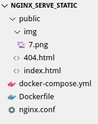

Вміст index.html:

```html
<!DOCTYPE html>
<html lang="en">
<head>
    <meta charset="UTF-8">
    <meta name="viewport" content="width=device-width, initial-scale=1.0">
    <meta http-equiv="X-UA-Compatible" content="ie=edge">
    <title>Document</title>
</head>
<body>
    NGINX Serve static
</body>
</html>
```

Вміст 404.html:

```html
<!DOCTYPE html>
<html lang="en">
<head>
    <meta charset="UTF-8">
    <meta name="viewport" content="width=device-width, initial-scale=1.0">
    <meta http-equiv="X-UA-Compatible" content="ie=edge">
    <title>404 Not found</title>
</head>
<body>
    
    <h1>404. Not found!!!</h1>

</body>
</html>
```

В рутовій директорії на рівні public створимо Dockerfile:

```Dockerfile
FROM ubuntu:latest

USER root

RUN apt-get update
RUN apt-get install -y nginx

# Remove the default Nginx configuration file
RUN rm -v /etc/nginx/nginx.conf

# Copy a configuration file from the current directory
ADD nginx.conf /etc/nginx/

ADD public /usr/share/nginx/html/
ADD public /var/www/html/

# Append "daemon off;" to the beginning of the configuration
RUN echo "daemon off;" >> /etc/nginx/nginx.conf

# Expose ports
EXPOSE 80

# Set the default command to execute
# when creating a new container
CMD service nginx start
```

В процесі будування буде зроблене наступне:

- В якості основи буде взята остання версія Ubuntu
- Установиться NGINX
- Видалиться файл конфігурації nginx, який використовується за замовчуванням
- Скопіюється файл конфігурації NGINX, який знаходиться в проекті
- Вміст проекту буде скопійований в /usr/share/nginx/html/, /var/www/html/ директорії контейнера
- daemon off; - потрібен для того щоб процес nginx не закривався, якщо запущений через docker.          Проблема полягає в тому, що спосіб роботи Nginx полягає в тому, що початковий процес негайно породжує основний процес Nginx та деяких працівників, а потім виходить з ладу. Оскільки Докер дивиться лише PID оригінальної команди, контейнер зупиняється.
- Виставляємо порт
- Запускаємо сервіс Nginx

Конфігурація самого NGINX виглядає наступним чином:

nginx.conf:
```
worker_processes 1;

events { worker_connections 1024; }

http {
    sendfile on;

    server {
        root /usr/share/nginx/html/;
        index index.html;
        server_name serve_static;
        listen 80;

        # Force all paths to load either itself (js files) or go through index.html.
        location = / {
            try_files /index.html =404;
        }

        location / {
            try_files $uri /404.html;
        }

    }
}
```

Створимо файл docker-compose.yml, який слугує лише для збирання нашого зображення:

docker-compose.yml:
```yml
version: '3'

services:
  nginx-serve-static:
    build:
      context: ./
      dockerfile: Dockerfile
    image: nginx-serve-static
    ports:
      - 80:80
```

Запустити проект можна командою:
```bash
docker-compose up --build
```


Проект можна знайти на [nginx-serve-static](https://github.com/endlesskwazar/distributed-databases-examples/tree/nginx-serve-static).


# Python, gunicorn, nginx

## Simple Flask docker app

Створимо наступну структуру директорій:

```
pf_nginx
-web
--src
```

В директорії src створимо пустий файл ```__init__.py```. Цей файл повідомляє інтерпретатор Python, що каталог src є пакетом, і його слід розглядати саме як пакет.

Також в директорії src створимо файл main.py:

**main.py**:

```py
from flask import Flask
import time

app = Flask(__name__)

@app.route("/")
def index():
    time.sleep(2)
    return "Response from flask"

if __name__ == "__main__":
    # Only for debugging while developing
    app.run(host="0.0.0.0", debug=True, port=8000)
```

В директорії web створимо файл requirements.txt. Цей фал містить всі залежності необхідні для роботи python - додатка.

**requirements.txt:**

```
Flask==1.1.1
```

Також в директорії web створимо Dockerfile:

**Dockerfile:**
```
FROM ubuntu:18.04

USER root

RUN apt-get update
RUN apt-get install -y python3-pip
RUN apt-get install -y nginx

WORKDIR /requirements
COPY requirements.txt ./

RUN pip3 install -r requirements.txt

WORKDIR /app

COPY ./src .

EXPOSE 8000

ENTRYPOINT [ "python3", "main.py" ]
```

- FROM ubuntu:18.04 - базове зображення
- USER root - активний користувач
- RUN apt-get update - оновлення репозиторіїв
- RUN apt-get install -y python3-pip - встановлення утиліти pip
- WORKDIR /requirements - активна робоча директорія
- COPY requirements.txt ./ - копіюємо requirements.txt
- RUN pip3 install -r requirements.txt - встановлюємо залежності
- WORKDIR /app - активна робоча директорія
- COPY ./src . - копіюємо код додатку
- EXPOSE 8000 - виставляємо порт
- ENTRYPOINT [ "python3", "main.py" ] - запускаємо команду, якщо інша не зазначена

Кінцева структура проекту:

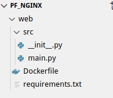

Побудувати зоображення можна командою:

```bash
$(pf_nginx) docker build -t pf_nginx_simple ./web
```

Запустити контейнер:

```bash
$(pf_nginx) docker container run -it -p 8000:8000 --name=pf_nginx_simple  pf_nginx_simple
```

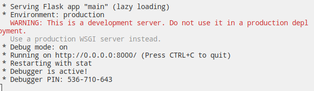


## Flask gunicorn docker app

Якщо подивитися на вивід запущеного flask додатку можна побачити попередження:

```
WARNING: This is a development server. Do not use it in a production deployment.
```

В наш поточний спосіб додаток ніяк не готовий до продакшина. Для цілей продакшина ми будемо використовувати gunicorn і nginx:


**Gunicorn** - автономний веб-сервер з великою функціональністю, наданої в зручному вигляді. Він спочатку підтримує різні фреймворки та адаптери, що робить його надзвичайно простий у використанні прямої заміною для багатьох серверів розробки.

Технічно Gunicorn працює подібно Unicorn, популярному веб-серверові додатків Ruby. Вони обидва використовують так звану pre-fork модель (це означає, що головний процес управляє ініційованими робочими процесами різного типу, створює сокети й з'єднання, і т.п.).

Модифікуємо файл **requirements.txt:**

```
Flask==1.1.1
gunicorn==20.0.4
```

В директорію src додамо файл wsgi.py, який буде служити точкою входу в наш додаток. Це покаже сервера Gunicorn, як взаємодіяти з додатком.

**wsgi.py:**

```py
from main import app

if __name__ == "__main__":
    app.run()
```

Для тестування змінимо ENTRYPOINT в Dockerfile:

**web/Dockerfile:**
```
FROM ubuntu:18.04

USER root

RUN apt-get update
RUN apt-get install -y python3-pip

WORKDIR /requirements
COPY requirements.txt ./

RUN pip3 install -r requirements.txt

WORKDIR /app

COPY ./src .

EXPOSE 8000

ENTRYPOINT [ "gunicorn", "--bind", "0.0.0.0:8000", "wsgi:app" ]
```

Побудувати зоображення можна командою:

```bash
$(pf_nginx) docker build -t pf_gunicorn_test ./web
```

Запустити контейнер:

```bash
$(pf_nginx) docker container run -it -p 8000:8000 --name=pf_gunicorn_test pf_gunicorn_test
```

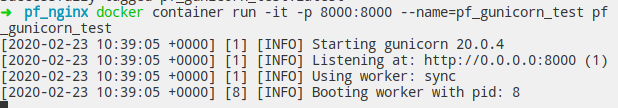


# Балансування навантаження

У термінології комп'ютерних мереж балансування навантаження або вирівнювання навантаження (англ. Load balancing) - метод розподілу завдань між декількома мережевими пристроями (наприклад, серверами) з метою оптимізації використання ресурсів, скорочення часу обслуговування запитів, горизонтального масштабування кластера (динамічне додавання / видалення пристроїв), а також забезпечення відмовостійкості (резервування).

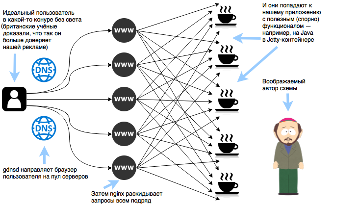

> - Взято із [habr](https://habr.com/ru/company/getintent/blog/329012/)

Є декілька алгоритмів балансування навантаження. Розглянемо ті, які присутні в Nginx:

- **Round Robin**

Перший з більш організованих методів балансування навантаження, круговий робот дуже схожий на однойменний стиль ігрового турніру. Кожному серверу в серверному пулі призначається місце в загальному порядку використання, і кожного разу, коли надходить новий трафік, він переходить на наступний сервер у списку.

Round Robin гарантує, що кожен сервер може адресувати вхідний трафік. Проблеми виникають, однак, коли враховується довжина або обробка попиту на з'єднання. Коли довгі з'єднання або з'єднання, що протікають через них значного трафіку, починають складатись на сервері, деякі сервери можуть закінчувати набагато більший трафік, ніж інші, попри те, що серверам надано рівне з'єднання.

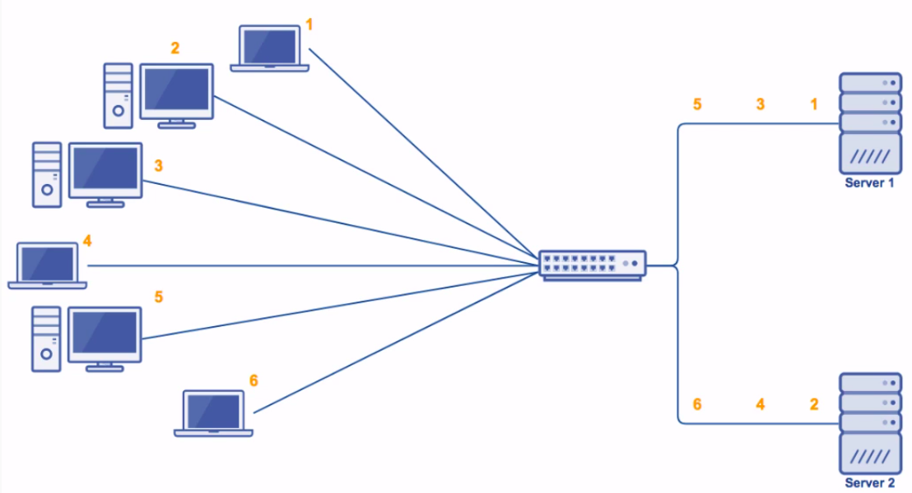

- **Weighted Round Robin**

Модифікація методу Round Robin, яка також бере до уваги ваги сервера.

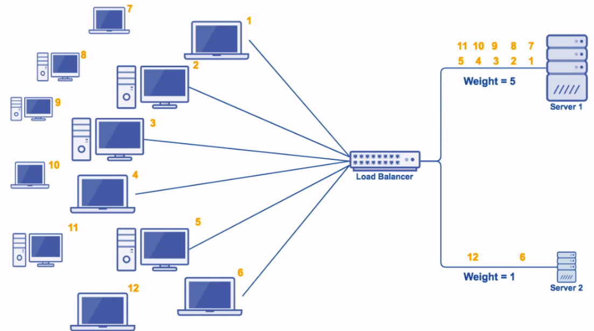

- **Least connections, weighted least connections**

У подібному до хешування класу джерела IP метод найменшого підключення фокусує свої зусилля щодо збалансування навантаження на розподіл трафіку на сервери, які в даний час мають найменше активне з'єднання. Ідея полягає в тому, що будь-який один сервер у пулі серверів ніколи не повинен закінчуватись значно більшою кількістю активних з'єднань, ніж будь-який інший.

Попри те, що у цього методу є проблеми із більшим часом з’єднання трафіку, що зберігаються на одному сервері, він також, за задумом, вирішує цю проблему краще, ніж інші методи. Навіть при триваліших або більш складних сесіях, розміщених на сервері, сервер ніколи не потрапить на значно більшу кількість користувачів, ніж будь-який інший сервер, що допомагає стримувати питання попиту.


Алгоритм може також враховувати ваги сервера:


- **Source IP hash**

IP-хешування працює для розподілу навантаження на основі вхідної IP-адреси серверного запиту, що робить його набагато складнішим, ніж раніше згадані методи. Вхідному навантаженню алгоритмічно присвоюється хеш-ключ на основі його вихідної IP-адреси та призначення, який потім використовується для призначення сервера для обробки вхідного навантаження.

IP-хешування може бути надзвичайно ефективним способом обробки вхідного трафіку, але є улов: Що робити, якщо з однієї IP-адреси надходить тонна трафіку? Це може призвести до перевантаження на одному сервері. Подолання цієї проблеми передбачає встановлення правил місткості або для кількості підключень на одному сервері з одного джерела, або для кількості підключень з одного джерела.
  


- **Generic Hash**

В цьому методі ми можемо назначити власну hash - функцію для балансування навантаження.

- **Random**

На сьогодні найменш організований з усіх методів балансування навантаження, випадкове присвоєння виконує саме те, що говорить: Він випадковим чином присвоює кожне робоче навантаження серверу в групі серверів (пул серверів).

Теорія, що стоїть за випадковим призначенням, звучить складніше, ніж є. У теорії ймовірностей Закон великих чисел говорить про те, що зі збільшенням кількості вибірки середній (середній) результат у наборі вибірки з часом буде відповідати середньому (середньому) результату. Застосовуваний тут, це означає, що чим більше випадковим чином навантаження робочим навантаженням присвоюється серверу в пулі, врешті-решт кожен сервер у пулі буде обробляти приблизно однакові робочі навантаження, хоча завантаження можуть спочатку бути неоднаковими.


# Балансування навантаження, використовуючи NGINX

Найпростіша конфігурація для балансування навантаження з nginx може виглядати наступним чином:

```
http {
    upstream myapp1 {
        server srv1.example.com;
        server srv2.example.com;
        server srv3.example.com;
    }

    server {
        listen 80;

        location / {
            proxy_pass http://myapp1;
        }
    }
}
```

У наведеному вище прикладі є 3 екземпляри однієї програми, що працює на srv1-srv3. Коли метод балансування навантаження не вказаний, він за замовчуванням є Round Robin. Усі запити передаються в проксі до групи серверів myapp1, і nginx застосовує балансування навантаження HTTP для розподілу запитів.


Інший метод балансування навантаження є least-connected. Метод least-connected в nginx активується, коли директива least-connected використовується як частина конфігурації групи серверів:

```
upstream myapp1 {
        least_conn;
        server srv1.example.com;
        server srv2.example.com;
        server srv3.example.com;
    }
```

Зауважте, що при балансуванні навантаження Round Robin або Least Connected кожен наступний запит клієнта може бути потенційно розподілений на інший сервер. Немає гарантії того, що той самий клієнт завжди буде спрямований на один і той же сервер.

Якщо є необхідність прив’язати клієнта до конкретного сервера додатків — іншими словами, зробіть сеанс клієнта "липким" або "стійким" з точки зору того, щоб завжди намагатися вибрати конкретний сервер — метод ip_hash може бути вибраний.

```cpp
upstream myapp1 {
    ip_hash;
    server srv1.example.com;
    server srv2.example.com;
    server srv3.example.com;
}
```

Також можливо ще більше впливати на алгоритми балансування навантаження nginx, використовуючи ваги сервера.

```
upstream myapp1 {
        server srv1.example.com weight=3;
        server srv2.example.com;
        server srv3.example.com;
}

upstream myapp1 {
        least_conn;
        server srv1.example.com weight=3;
        server srv2.example.com;
        server srv3.example.com;
}
```


## Python, gunicorn, nginx load balancing

Для початку створимо docker-compose.yml файл в корені проекту і спробуємо розгортати більше одного web - контейнера:

**docker-compose.yml:**

```yml
version: '3'

services:
  web_1:
    build:
      context: ./web
      dockerfile: Dockerfile
    image: web_1
    ports:
      - ${WEB_1_PORT}:${WEB_1_PORT}
    environment:
      - PORT=${WEB_1_PORT}
```

Файл docker-compose.yml використовує змінні оточення тому створимо файл .env:

**.env**:

```
WEB_1_PORT=8001
WEB_2_PORT=8002
WEB_3_PORT=8003
```

Нам також доведеться модифікувати Dockerfile для python - додатка:

**web/Dockerfile:**:

```
FROM ubuntu:18.04

USER root

RUN apt-get update
RUN apt-get install -y python3-pip

WORKDIR /requirements
COPY requirements.txt ./

RUN pip3 install -r requirements.txt

WORKDIR /app

COPY ./src .

EXPOSE ${PORT}

ENTRYPOINT gunicorn --bind 0.0.0.0:${PORT} --workers=3 wsgi:app
```

І для тестування модифікуємо сам додаток:

**web/src/main.py**:

```py
import os
from flask import Flask, request
import time

app = Flask(__name__)

@app.route("/")
def index():
    return "Response from flask on " + os.environ.get('PORT')

if __name__ == "__main__":
    # Only for debugging while developing
    app.run(host="0.0.0.0", debug=True, port=8000)
```

Запустити інфраструктуру можна за допомогою команди:

```bash
docker-compose up --build
```

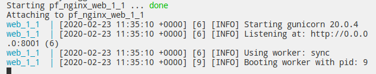

Додамо ще два сервіси:

**docker-compose.yml:**
```yml
version: '3'

services:
  web_1:
    build:
      context: ./web
      dockerfile: Dockerfile
    image: web_1
    ports:
      - ${WEB_1_PORT}:${WEB_1_PORT}
    environment:
      - PORT=${WEB_1_PORT}
  web_2:
    build:
      context: ./web
      dockerfile: Dockerfile
    image: web_2
    ports:
      - ${WEB_2_PORT}:${WEB_2_PORT}
    environment:
      - PORT=${WEB_2_PORT}
  web_3:
    build:
      context: ./web
      dockerfile: Dockerfile
    image: web_3
    ports:
      - ${WEB_3_PORT}:${WEB_3_PORT}
    environment:
      - PORT=${WEB_3_PORT}
```

Запустити інфраструктуру можна за допомогою команди:

```bash
docker-compose up --build
```

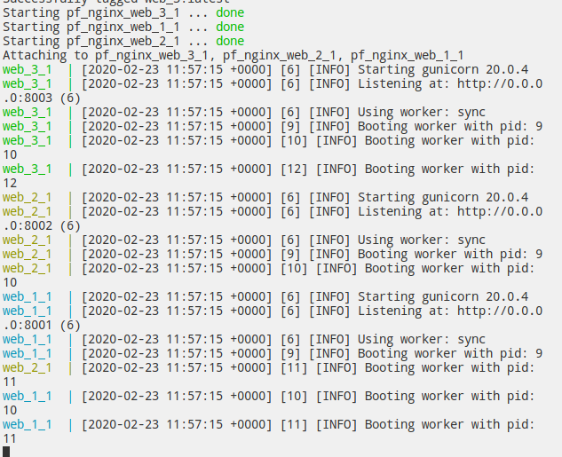


Створимо в рутовій лиректорії директорію balancer а в ній Dockerfile і nginx.conf.

**Dockerfile:**
```
FROM ubuntu:latest

USER root

RUN apt-get update
RUN apt-get install -y nginx

# Remove the default Nginx configuration file
RUN rm -v /etc/nginx/nginx.conf

# Copy a configuration file from the current directory
ADD nginx.conf /etc/nginx/

# Append "daemon off;" to the beginning of the configuration
RUN echo "daemon off;" >> /etc/nginx/nginx.conf

# Expose ports
EXPOSE 80

# Set the default command to execute
# when creating a new container
CMD ["/usr/sbin/nginx"]
```

На основі ubuntu ми поставмо nginx перезапишемой файл конфігурації і запустимо nginx.

**nginx.conf:**
```
http {
    upstream python-cluster {
        server 172.17.0.1:8001;
        server 172.17.0.1:8002;
        server 172.17.0.1:8003;
    }

    server {
        listen 80;

        location / {
            proxy_set_header X-Forwarded-For $proxy_add_x_forwarded_for;
            proxy_pass http://python-cluster;
        }
    }
}
events {
    worker_connections 1024;
}
```

В конфігурації ми створюємо кластер із 3-х серверів і розподіляємо навантаження між кластером з використанням Round-Robin(оскільки інше не вказано).

Модифікуємо файл docker-compose.yml:
```yml
version: '3'

services:
  balancer:
    build:
      context: ./balancer
      dockerfile: Dockerfile
    image: balancer
    ports:
      - 80:80
    depends_on: 
      - web_1
      - web_2
      - web_3
  web_1:
    build:
      context: ./web
      dockerfile: Dockerfile
    image: web_1
    ports:
      - ${WEB_1_PORT}:${WEB_1_PORT}
    environment:
      - PORT=${WEB_1_PORT}
  web_2:
    build:
      context: ./web
      dockerfile: Dockerfile
    image: web_2
    ports:
      - ${WEB_2_PORT}:${WEB_2_PORT}
    environment:
      - PORT=${WEB_2_PORT}
  web_3:
    build:
      context: ./web
      dockerfile: Dockerfile
    image: web_3
    ports:
      - ${WEB_3_PORT}:${WEB_3_PORT}
    environment:
      - PORT=${WEB_3_PORT}
```

Запустити додатко можна за допомогою команди:

```bash
docker-compose up --build
```

Тепер проведемо експеремент:
1. Зупинимо контейнер 2-го сервера ```docker stop pf_nginx_web_2_1 ```

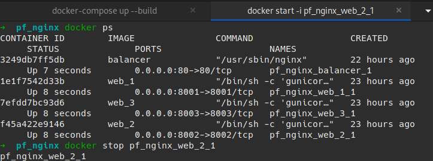

2. Подивимося як веде себе балансування навантаження
3. Піднімемо контейнер 2-го сервера знову ```docker start -i pf_nginx_web_2_1 ```

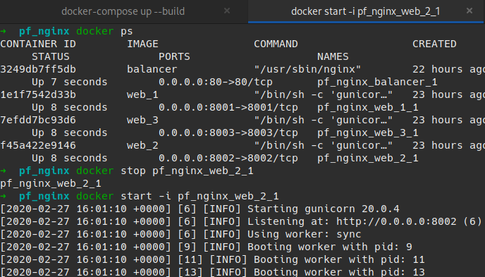

4. Подивимося як веде себе балансування навантаження

## Готовий проект

Готовий проект можна знайти на [nginx_load_balancer](https://github.com/endlesskwazar/distributed-databases-examples/tree/nginx_load_balancer)

# Домашнє завдання

Використовуючи docker, docker-compose створіть інфраструктуру із п'яти серверів, між якими відбувається масштабування навантаження. Python використовувати заборонено. Всі інші технології(node, php, java, c#, go і т.д.) використовувати дозволяється.

# Контрольні запитання

1. Що таке NGINX? Перелічіть області застосування NGINX.
2. Поясніть процес конфігурації NGINX.
3. Що таке балансування навантаження? Перелічіть і поясніть методи балансування.
4. Поясніть конфігурацію NGINX для балансування навантаження.