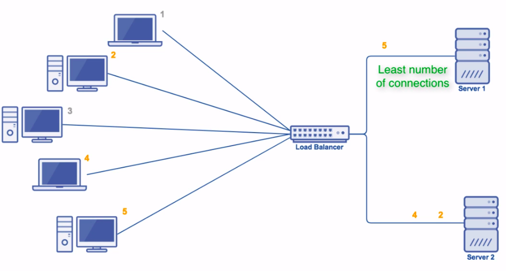
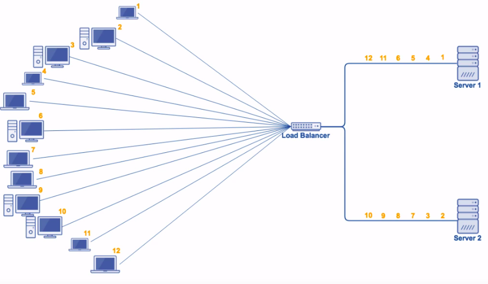

# Docker

# Зміст

${toc}

# NGINX

**NGINX [engine x]** - це HTTP-сервер і зворотній проксі-сервер, поштовий проксі-сервер, а також TCP / UDP проксі-сервер загального призначення, спочатку написаний Ігорем Сисоєвим. Уже тривалий час він обслуговує сервери багатьох високонавантажених сайтів.

Згідно зі статистикою Netcraft nginx обслуговував або проксіровать 25.44% самих навантажених сайтів в січні 2020 року.

Практичне застосування NGINX:
- При наявності великої кількості статичного контенту або файлів для завантаження, можна налаштувати на окремому порту або IP, щоб здійснювати роздачу. При великій кількості запитів рекомендується ставити окремий сервер і підключати до нього Nginx.
- sdfsdf
- sdf

## NGINX vs Apache

Веб-сервер Nginx в порівнянні з Apache працює швидше при віддачі статики і споживає менше серверних ресурсів. Його використовує замість або разом з Apache для прискорення обробки запитів і зменшення навантаження. Це обумовлюється тим, що більша частина тих можливостей, які пропонує Apache, більшості звичайних користувачів не потрібно.

Оскільки широкий функціонал Nginx вимагає і значно більших ресурсів системи, постійно застосовувати повноцінну зв'язку «Nginx + Apache» недоцільно. Найчастіше обидва веб-сервера використовуються в симбіозі - Nginx віддає статику і перенаправляє обробку скриптів Apache.

# Конфігурація NGINX

# Docker і NGINX. Serve static

Створимо директорію static а в ній HTML файл text.txt

В директорії static створимо директорію media і в ній sound.mp3

В рутовій директорії на рівні static створимо Dockerfile:

```dockerfile

```

# Python, gunicorn, nginx

# Балансування навантаження

У термінології комп'ютерних мереж балансування навантаження або вирівнювання навантаження (англ. Load balancing) - метод розподілу завдань між декількома мережевими пристроями (наприклад, серверами) з метою оптимізації використання ресурсів, скорочення часу обслуговування запитів, горизонтального масштабування кластера (динамічне додавання / видалення пристроїв), а також забезпечення відмовостійкості (резервування).


> - Взято із [habr](https://habr.com/ru/company/getintent/blog/329012/)

Є декілька лгоритмів балансування навантаження. Розглянемо ті, які присутні в Nginx:

- **Round Robin**

Перший з більш організованих методів балансування навантаження, круговий робот дуже схожий на однойменний стиль ігрового турніру. Кожному серверу в серверному пулі призначається місце в загальному порядку використання, і кожного разу, коли надходить новий трафік, він переходить на наступний сервер у списку.

Round Robin гарантує, що кожен сервер може адресувати вхідний трафік. Проблеми виникають, однак, коли враховується довжина або обробка попиту на з'єднання. Коли довгі з'єднання або з'єднання, що протікають через них значного трафіку, починають складатись на сервері, деякі сервери можуть закінчувати набагато більший трафік, ніж інші, незважаючи на те, що серверам надано рівне з'єднання.


- **Weighted Round Robin**

Модифікація методу Round Robin, яка також бере до уваги ваги сервера.


- **Least connections, weighted least connections**

У подібному до хешування класу джерела IP метод найменшого підключення фокусує свої зусилля щодо збалансування навантаження на розподіл трафіку на сервери, які в даний час мають найменше активне з'єднання. Ідея полягає в тому, що будь-який один сервер у пулі серверів ніколи не повинен закінчуватись значно більшою кількістю активних з'єднань, ніж будь-який інший.

Незважаючи на те, що у цього методу є проблеми із більшим часом з’єднання трафіку, що зберігаються на одному сервері, він також, за задумом, вирішує цю проблему краще, ніж інші методи. Навіть при триваліших або більш складних сесіях, розміщених на сервері, сервер ніколи не потрапить на значно більший кількість користувачів, ніж будь-який інший сервер, що допомагає стримувати питання попиту.


Алгоритм може також враховувати ваги сервера:



- **Source IP hash**

IP-хешування працює для розподілу навантаження на основі вхідної IP-адреси серверного запиту, що робить його набагато складнішим, ніж раніше згадані методи. Вхідному навантаженню алгоритмічно присвоюється хеш-ключ на основі його вихідної IP-адреси та призначення, який потім використовується для призначення сервера для обробки вхідного навантаження.


IP-хешування може бути надзвичайно ефективним способом обробки вхідного трафіку, але є улов: Що робити, якщо з однієї ІР-адреси надходить тонна трафіку? Це може призвести до перевантаження на одному сервері. Подолання цієї проблеми передбачає встановлення правил ємності або для кількості підключень на одному сервері з одного джерела, або для кількості підключень з одного джерела.
  


- **Generic Hash**

В цьому методі ми можемо назначити власну hash - функцію для балансування навантаження.

- **Random**

На сьогодні найменш організований з усіх методів балансування навантаження, випадкове присвоєння виконує саме те, що говорить: Він випадковим чином присвоює кожне робоче навантаження серверу в групі серверів (пул серверів).

Теорія, що стоїть за випадковим призначенням, звучить складніше, ніж є. У теорії ймовірностей Закон великих чисел говорить про те, що зі збільшенням кількості вибірки середній (середній) результат у наборі вибірки з часом буде відповідати середньому (середньому) результату. Застосовуваний тут, це означає, що чим більше випадковим чином навантаження робочим навантаженням присвоюється серверу в пулі, врешті-решт кожен сервер у пулі буде обробляти приблизно однакові робочі навантаження, хоча завантаження можуть спочатку бути неоднаковими.



# Балансування навантаження, використовуючи NGINX

# Домашнє завдання

Використовуючи Docker Compose створіть середовище розробки для застосунка на PHP, який використовує MySQL. Проект завантажити на репозиторій(гілка lb1). Додати користувача endlesskwazar@gmail.com до репозитоія.

# Контрольні запитання
1. Що таке Docker? Наведіть області його застосування.
2. Чим образи відрізняються від контейнерів?
3. Що таке Dockerfile. Перелічіть, що в ньому може бути написане.
4. Чим COPY відрізняється від ADD?
5. Що таке Docker - compose?