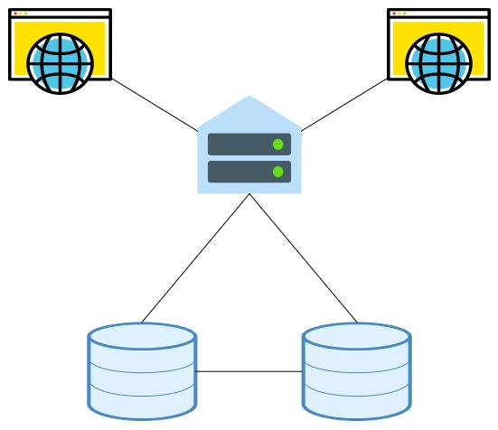
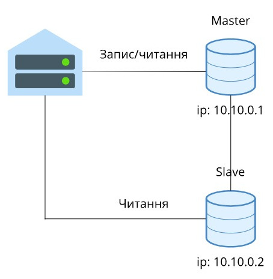
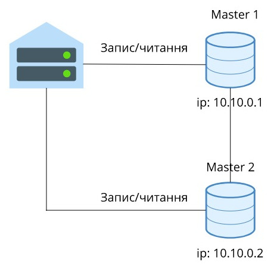

# Реплікація баз даних

${toc}

# Що таке реплікація?

**Реплікація** (англ. Replication) - механізм синхронізації вмісту копій об'єкта (наприклад, вмісту баз даних). Реплікація - це процес, під яким розуміється копіювання даних з одного джерела на інший (або на кількість інших) і навпаки.

При рерлікації зміни, зроблені в одній копії об'єкта, можуть бути поширені в інших копіях.



# Що дає реплікація?

- Для додатків з'являється можливість використовувати не один сервер для обробки всіх запитів, а декілька. Таким чином з'являється можливість розподілити навантаження з одного сервера на кілька серверів.
- Відмовостійкість. Якщо одна нода упаде, запити можна перенапрвити на іншу.

# Види реплікації

Існує два основні підходи при роботі з реплікацією даних:

- Реплікація Master-Slave;
- Реплікація Master-Master.

Синхронізація даних, при рекплікації може бути:

- Синхронна
- Асинхронна

# Реплікація Master-Slave

У цьому підході виділяється один основний сервер бази даних, який називається Master. На ньому відбуваються всі зміни в даних (будь-які запити MySQL INSERT / UPDATE / DELETE). Slave сервер постійно копіює всі зміни з Master. З додатка на Slave сервер відправляються запити читання даних (запити SELECT). Таким чином Майстер сервер відповідає за зміни даних, а Слейв за читання.



У додатку потрібно використовувати два з'єднання - одне для master, друге - для slave:

```php
<?
$master = mysql_connect('10.10.0.1', 'root', 'pwd');
$slave = mysql_connect('10.10.0.2', 'root', 'pwd');

# ...
mysql_query('INSERT INTO users ...', $master);

# ...
$q = mysql_query('SELECT * FROM photos ...', $slave);
```

## Декілька слейвів

Перевага цього типу реплікації в тому, що Ви можете використовувати більше одного слейв. Зазвичай слід використовувати не більше 20 Слейв серверів при роботі з одним Майстром.


Тоді з програми Ви вибираєте випадковим чином один із ідфму - серверів для обробки запитів:

```php
<?
$master = mysql_connect('10.10.0.1', 'root', 'pwd');
$slaves = [
	'10.10.0.2',
	'10.10.0.3',
	'10.10.0.4',
];
$slave = mysql_connect($slaves[array_rand($slaves)], 'root', 'pwd');

# ...
mysql_query('INSERT INTO users ...', $master);

# ...
$q = mysql_query('SELECT * FROM photos ...', $slave);
```

## Master-Slave відмовостійкість

При виході з ладу slave - сервера, досить просто перемкнути всі додатоки на роботу з master- сервером. Після відновити реплікацію на slave і знову його запустити.

Якщо виходить з ладу master, потрібно переключити всі операції (і читання і запису) на slave. Таким чином він стане новим master - сервером. Після відновлення старого master - серверу, налаштувати на ньому репліку, і він стане новим слейв.

## Master-Slave резервування

Набагато частіше реплікацію Master-Slave використовують не для масштабування, а для резервування. В цьому випадку, Master - сервер обробляє всі запити від програми. Слейв сервер працює в пасивному режимі. Але в разі виходу з ладу Master - сервера, всі операції переключаються на Slave.

# Реплікація Master-Master

У цій схемі, будь-який з серверів може використовуватися як для читання так і для запису.



При використанні такого типу реплікації досить вибирати випадкове з'єднання з доступних Майстрів:

```php
<?
$masters = [
	'10.10.0.1',
	'10.10.0.2',
	'10.10.0.3',
];
$master = mysql_connect($masters[array_rand($masters)], 'root', 'pwd');

# ...
mysql_query('INSERT INTO users ...', $master);
```

Переваги Master-Master реплікації:
-іваів-ів
-іваіва

Недоліки Master-Master реплікації

# Синхронізація даних

## Асинхронна реплікація

Ось приблизна схема того, як працює **асинхронна реплікація** в додатку.


Від клієнта отримуємо "commit", коммітим транзакцію. Надсилаємо клієнту "ОК". А потім якось відсилаємо дані на slave - сервер. У цьому місці наші дані можуть бути втрачені, якщо slave раптом "впав". Ці дані можуть бути втрачені до відновлення сервера або назавжди. Якщо у вас «полетів» блок живлення, якщо у вас не було батарейки в диску чи сталася інша подібна річ, частинам даних практично завжди доводиться говорити "до побачення".

Для ряду випадків це абсолютно не принципово. Якщо загубиться який-небудь коментар на безкоштовному форумі, то це нікого не хвилює. А ось в фінансових або телекомунікаційних додатках втрата даних не повинна відбуватися ні в якому разі. Єдине рішення - це **синхронна реплікація**.

## Синхронна реплікація


Ми отримуємо "commit" від клієнта, відправляємо дані транзакції на slave - сервер. Чекаємо підтвердження від нього. Тільки після цього і говоримо клієнтові "ОК".

Тут у нас виникає якась затримка "спілкування" з slave - сервером в момент виконання операції "commit". Саме ця затримка є причиною уявлень про те, що все буде вкрай повільно.

# Налаштування реплікації в MySQL з використанням Docker


# Ручна реплікація

Слід пам'ятати, що реплікація - це не технологія, а методика. Вбудовані механізми реплікації можуть принести непотрібні ускладнення або не мати якийсь потрібної функції. Деякі технології взагалі не мають вбудованої реплікації.

У таких випадках, слід використовувати самостійну реалізацію реплікації. У найпростішому випадку, додаток буде дублювати всі запити відразу на кілька серверів бази даних.

При запису даних, всі запити будуть відправлятися на кілька серверів. Зате операції читання можна буде відправляти на будь-який сервер. Навантаження при цьому буде розподілятися по всім доступним серверів:

```php
<?
$dbs = [
	'10.10.0.1',
	'10.10.0.2'
];

foreach ( $dbs as $db )
{
	$connection = mysql_connect($db, 'root', 'pwd');
	mysql_query('INSERT INTO users ...', $connection);
}


# ...

$connection_read = mysql_connect($dbs[array_rand($dbs)], 'root', 'pwd');
mysql_query('SELECT * FROM users WHERE ...', $connection_read);
```

# Summary

Реплікація використовується в більшій мірі для резервування баз даних і в меншій для масштабування. Master-Slave реплікація зручна для розподілу запитів читання по декількох серверах.

# Домашнє завдання

## Варіанти

# Контрольні запитання

1. Що таке реплікація?
2. Поясніть реплікація Master-Slave.
3. Поясніть реплікація Master-Master.
4. В чому відмінність між синхронною і асинхронною реплікацією?
5. Поясніть процес налаштування реплікації MySQL.