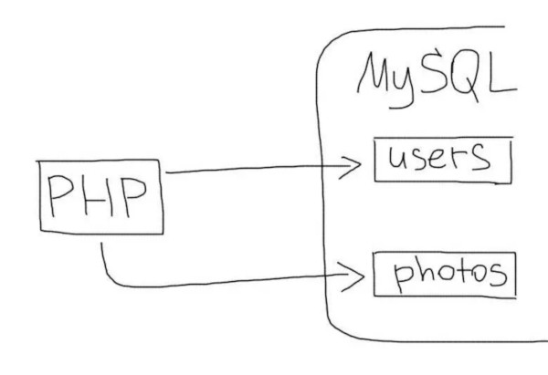
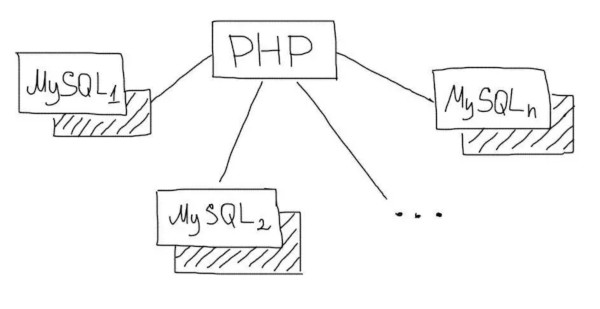

# Шардування баз даних

${toc}

# Що таке шардинг баз даних?

**Шардинг** - це техніка масштабування роботи з даними. Суть його в поділі (партіціонірованіе) бази даних на окремі частини так, щоб кожну з них можна було винести на окремий сервер. Цей процес залежить від структури Вашої бази даних і виконується прямо в додатку на відміну від реплікації.


Шардинг буває **вертикальний** і **горизонтальний**.

# Вертикальний шардинг

Зазвичай Web додатки працюють з одним сервером бази даних. У більшості випадків додаток використовує більше однієї таблиці.



Однією з технік масштабування бази даних є поділ таблиць по різних серверах. У цьому випадку кілька таблиць будуть знаходиться на одному сервері, а інші на іншому. Тоді запити до різних таблицях будуть оброблятися різними серверами бази даних. Це і називається **вертикальним шардінгом**.


Сервера з різними таблицями називаються Шардена. Деякі таблиці зазвичай більше за інших. Шардінг зазвичай починають з найбільш великих і навантажених таблиць. Їх виділяють в окрему групу і виносять на окремий сервер.


Наприклад, в додатку є такі таблиці:
- users
- photos
- albums

Таблицю users Ви залишаєте на одному сервері, а таблиці photos і albums переносите на інший. В такому випадку в додатку Вам необхідно буде використовувати відповідне з'єднання для роботи з кожною таблицею:

```php
<?
$ Users_connection = mysql_connect ('10 .10.0.1 ',' root ',' pwd ');
$ Photos_connection = mysql_connect ('10 .10.0.2 ',' root ',' pwd ';

# Якийсь код і все таке ...
$ Q = mysql_query ( 'SELECT * FROM users WHERE ...', $ users_connection);

# Ще якийсь код ...
$ Q = mysql_query ( 'SELECT * FROM photos WHERE ...', $ photos_connection);

# Ще якийсь код ...
$ Q = mysql_query ( 'SELECT * FROM albums WHERE ...', $ photos_connection);
```

## Join`s

Зрозуміло, що JOIN двох таблиць на різних серверах зробити неможливо. Є два варіанти вирішення цього завдання.

### Групи таблиць

Часто JOIN запити мають місце тільки між якоюсь групою таблиць, які логічно пов'язані один з одним. Наприклад таблиці, які зберігають дані про альбоми та фотографії користувачів:
- photos
- albums

В такому випадку зручніше виносити на окремий шард відразу всю групу цих таблиць. Це дозволить використовувати JOIN в рамках цієї групи.


### Вибірка в додатку

В іншому варіанті, функціональність JOIN'a доведеться перенести на додаток. Наприклад, такий запит:

```sql
SELECT * FROM photos p JOIN albums a ON (a.id = p.album_id) WHERE a.user_id = 1
```

```php
<?

# ...
$q = mysql_query('SELECT * FROM albums WHERE user_id = 1', $connection_albums);
$albums = mysql_fetch_all($q);


# Отримуємо список ID альбомів користувача
foreach ( $albums as $album ) $album_ids[] = $album['id'];


# Вибираємо всі фотки для зазначених альбомів
$q = mysql_query('SELECT * FROM photos WHERE album_id IN (' . implode(',', $album_ids) . ')', $connection_photos)
```

# Горизонтальний шардинг

**Горизонтальний шардінг** - це поділ однієї таблиці на різні сервера. Це необхідно використовувати для величезних таблиць, які не поміщаються на одному сервері. Поділ таблиці на шматки робиться за таким принципом:
- На кількох серверах створюється одна і та ж таблиця (тільки структура, без даних).
- У додатку вибирається умова, за яким буде визначатися потрібне з'єднання (наприклад, парні на один сервер, а непарні - на інший).
- Перед кожним зверненням до таблиці відбувається вибір потрібного з'єднання.

Припустимо, наш додаток працює з величезною таблицею, яка зберігає фотографії користувачів. Ми підготували два сервера (зазвичай вони називаються Шарден) для цієї таблиці. Для непарних користувачів ми будемо працювати з першими сервером, а для парних - з другим. Таким чином, на кожному з серверів буде тільки частина всіх даних про фотках користувачів. Це буде виглядати так:

```php
<?
# Список з'єднань для таблиці з фотками
$ Photo_connections = [
'1' => '10 .10.0.1 ',
'2' => '10 .10.0.2 ',
];
$ User_id = $ _SESSION [ 'user_id'];
# Отримання фотографій для користувача $ user_id
$ Connection_num = $ user_id% 2 == 0? 1: 2;
$ Connection = mysql_connect ($ photo_connections [$ connection_num], 'root', 'pwd');
$ Q = mysql_query ( 'SELECT * FROM photos WHREE user_id ='. Intval ($ user_id), $ connection);
```

Горизонтальний шардінг - це дуже потужний інструмент масштабування даних. Але в той же час і дуже нетривіальний.

Не слід застосовувати техніку шардінга до всіх таблиць. Правильний підхід - це поетапний процес поділу зростаючих таблиць. Слід замислюватися про горизонтальному шардінге, коли кількість записів в одній таблиці переходить за межі від кількох десятків мільйонів до сотень мільйонів.

# Відмовостійкість

Імовірність поломки серверів баз даних збільшується зі зростанням їх кількості.


Для забезпечення відмовостійкості необхідно резервувати сервера баз даних за допомогою реплікації. В такому випадку, кожен шард матиме резервний сервер з копією даних.



У разі виходу з ладу одного з Шардена досить буде переключити його з'єднання на резервний сервер.

# Sharding-JDBC

[ShardingSphere](https://shardingsphere.apache.org/) is an open-source ecosystem consisted of a set of distributed database middleware solutions, including 3 independent products, Sharding-JDBC, Sharding-Proxy & Sharding-Sidecar (todo). They all provide functions of data sharding, distributed transaction and database orchestration, applicable in a variety of situations such as Java isomorphism, heterogeneous language and cloud native.

**Sharding-JDBC** defines itself as a lightweight Java framework that provides extra service at Java JDBC layer. With client end connecting directly to the database, it provides service in the form of jar and requires no extra deployment and dependence. It can be considered as an enhanced JDBC driver, which is fully compatible with JDBC and all kinds of ORM frameworks.

- Applicable in any ORM framework based on Java, such as JPA, Hibernate, Mybatis, Spring JDBC Template or direct use of JDBC.
- Based on any third-party database connection pool, such as DBCP, C3P0, BoneCP, Druid, HikariCP.
- Support any kind of database that conforms to JDBC standard: MySQL，Oracle，SQLServer and PostgreSQL for now.

## Sharding-JDBC demo


### Скрипт бази даних

```sql
DROP SCHEMA IF EXISTS demo_ds_0;
DROP SCHEMA IF EXISTS demo_ds_1;
CREATE SCHEMA IF NOT EXISTS demo_ds_0;
CREATE SCHEMA IF NOT EXISTS demo_ds_1;

-- Виконати для всіх схем:
CREATE TABLE IF NOT EXISTS t_order_0 (order_id BIGINT AUTO_INCREMENT, user_id INT NOT NULL, status VARCHAR(50), PRIMARY KEY (order_id));  
CREATE TABLE IF NOT EXISTS t_order_item_0 (order_item_id BIGINT AUTO_INCREMENT, order_id BIGINT, user_id INT NOT NULL, status VARCHAR(50), PRIMARY KEY (order_item_id));    
  
CREATE TABLE IF NOT EXISTS t_order_1 (order_id BIGINT AUTO_INCREMENT, user_id INT NOT NULL, status VARCHAR(50), PRIMARY KEY (order_id));  
CREATE TABLE IF NOT EXISTS t_order_item_1 (order_item_id BIGINT AUTO_INCREMENT, order_id BIGINT, user_id INT NOT NULL, status VARCHAR(50), PRIMARY KEY (order_item_id));
```

### pom.xml

```xml
<?xml version="1.0" encoding="UTF-8"?>
<project xmlns="http://maven.apache.org/POM/4.0.0" xmlns:xsi="http://www.w3.org/2001/XMLSchema-instance"
	xsi:schemaLocation="http://maven.apache.org/POM/4.0.0 http://maven.apache.org/xsd/maven-4.0.0.xsd">
	<modelVersion>4.0.0</modelVersion>
	<parent>
		<groupId>org.springframework.boot</groupId>
		<artifactId>spring-boot-starter-parent</artifactId>
		<version>1.5.19.RELEASE</version>
		<relativePath/> <!-- lookup parent from repository -->
	</parent>
	<groupId>com.example</groupId>
	<artifactId>demo</artifactId>
	<version>0.0.1-SNAPSHOT</version>
	<name>demo</name>
	<description>Demo project for Spring Boot</description>

	<properties>
		<project.build.sourceEncoding>UTF-8</project.build.sourceEncoding>
		<project.reporting.outputEncoding>UTF-8</project.reporting.outputEncoding>
		<java.version>1.8</java.version>
	</properties>

	<dependencies>
		<dependency>
			<groupId>org.springframework.boot</groupId>
			<artifactId>spring-boot-starter</artifactId>
		</dependency>
		
		<dependency>
			<groupId>org.springframework.boot</groupId>
			<artifactId>spring-boot-starter-web</artifactId>
		</dependency>
		
		<dependency>
			<groupId>io.shardingjdbc</groupId>
			<artifactId>sharding-jdbc-core-spring-boot-starter</artifactId>
			<version>2.0.3</version>
		</dependency>

		<dependency>
			<groupId>org.mybatis.spring.boot</groupId>
			<artifactId>mybatis-spring-boot-starter</artifactId>
			<version>1.3.0</version>
		</dependency>

		<dependency>
			<groupId>commons-dbcp</groupId>
			<artifactId>commons-dbcp</artifactId>
			<version>1.4</version>
		</dependency>

		<dependency>
			<groupId>mysql</groupId>
			<artifactId>mysql-connector-java</artifactId>
			<version>5.1.30</version>
		</dependency>

		<dependency>
			<groupId>org.springframework.boot</groupId>
			<artifactId>spring-boot-starter-test</artifactId>
			<scope>test</scope>
		</dependency>
	</dependencies>

	<build>
		<plugins>
			<plugin>
				<groupId>org.springframework.boot</groupId>
				<artifactId>spring-boot-maven-plugin</artifactId>
			</plugin>
		</plugins>
	</build>

</project>
```

### application.properties

```
sharding.jdbc.datasource.names=ds_0,ds_1

sharding.jdbc.datasource.ds_0.type=org.apache.commons.dbcp.BasicDataSource
sharding.jdbc.datasource.ds_0.driver-class-name=com.mysql.jdbc.Driver
sharding.jdbc.datasource.ds_0.url=jdbc:mysql://localhost:3306/demo_ds_0
sharding.jdbc.datasource.ds_0.username=root
sharding.jdbc.datasource.ds_0.password=

sharding.jdbc.datasource.ds_1.type=org.apache.commons.dbcp.BasicDataSource
sharding.jdbc.datasource.ds_1.driver-class-name=com.mysql.jdbc.Driver
sharding.jdbc.datasource.ds_1.url=jdbc:mysql://localhost:3306/demo_ds_1
sharding.jdbc.datasource.ds_1.username=root
sharding.jdbc.datasource.ds_1.password=

sharding.jdbc.config.sharding.default-database-strategy.inline.sharding-column=user_id
sharding.jdbc.config.sharding.default-database-strategy.inline.algorithm-expression=ds_${user_id % 2}

sharding.jdbc.config.sharding.tables.t_order.actual-data-nodes=ds_${0..1}.t_order_${0..1}
sharding.jdbc.config.sharding.tables.t_order.table-strategy.inline.sharding-column=order_id
sharding.jdbc.config.sharding.tables.t_order.table-strategy.inline.algorithm-expression=t_order_${order_id % 2}
sharding.jdbc.config.sharding.tables.t_order.key-generator-column-name=order_id
sharding.jdbc.config.sharding.tables.t_order_item.actual-data-nodes=ds_${0..1}.t_order_item_${0..1}
sharding.jdbc.config.sharding.tables.t_order_item.table-strategy.inline.sharding-column=order_id
sharding.jdbc.config.sharding.tables.t_order_item.table-strategy.inline.algorithm-expression=t_order_item_${order_id % 2}
sharding.jdbc.config.sharding.tables.t_order_item.key-generator-column-name=order_item_id


mybatis.config-location=classpath:META-INF/mybatis-config.xml

logging.level.org.springframework=WARN
logging.level.com.spring.ibatis.UserMapper=DEBUG
logging.file=logs/spring-boot-logging.log
```

### Entities

**Order.java**:

```java
package com.example.demo;

public final class Order {
    
    private long orderId;
    
    private int userId;
    
    private String status;
    
    public long getOrderId() {
        return orderId;
    }
    
    public void setOrderId(final long orderId) {
        this.orderId = orderId;
    }
    
    public int getUserId() {
        return userId;
    }
    
    public void setUserId(final int userId) {
        this.userId = userId;
    }
    
    public String getStatus() {
        return status;
    }
    
    public void setStatus(final String status) {
        this.status = status;
    }
    
    @Override
    public String toString() {
        return String.format("order_id: %s, user_id: %s, status: %s", orderId, userId, status);
    }
}
```

**OrderItem.java**:
```java
package com.example.demo;

public final class OrderItem {
    
    private long orderItemId;
    
    private long orderId;
    
    private int userId;
    
    private String status;
    
    public long getOrderItemId() {
        return orderItemId;
    }
    
    public void setOrderItemId(final long orderItemId) {
        this.orderItemId = orderItemId;
    }
    
    public long getOrderId() {
        return orderId;
    }
    
    public void setOrderId(final long orderId) {
        this.orderId = orderId;
    }
    
    public int getUserId() {
        return userId;
    }
    
    public void setUserId(final int userId) {
        this.userId = userId;
    }
    
    public String getStatus() {
        return status;
    }
    
    public void setStatus(final String status) {
        this.status = status;
    }
    
    @Override
    public String toString() {
        return String.format("item_id:%s, order_id: %s, user_id: %s, status: %s", orderItemId, orderId, userId, status);
    }
}
```

### Repository

**OrderRepository**:

```java
package com.example.demo;

import org.apache.ibatis.annotations.Mapper;

@Mapper
public interface OrderRepository {

	Long insert(Order model);
}
```

**OrderItemRepository**:
```java
package com.example.demo;

import org.apache.ibatis.annotations.Mapper;

@Mapper
public interface OrderItemRepository {

	Long insert(OrderItem model);
	
}
```

### service

```java
package com.example.demo;

import javax.annotation.Resource;

import org.springframework.stereotype.Service;

@Service
public class DemoService {
    
    @Resource
    private OrderRepository orderRepository;
    
    @Resource
    private OrderItemRepository orderItemRepository;

    public String insert(Integer userId) {
        Order order = new Order();
        order.setUserId(userId);
        order.setStatus("INSERT_TEST");
        orderRepository.insert(order);

        long orderId = order.getOrderId();
        OrderItem item = new OrderItem();
        item.setOrderId(orderId);
        item.setUserId(userId);
        item.setStatus("INSERT_TEST");
        orderItemRepository.insert(item);

        return orderId + "|" + item.getOrderItemId();
    }
}
```

### MyBatis

**mybatis-config.xml**:

```xml
<?xml version="1.0" encoding="UTF-8" ?>
<!DOCTYPE configuration
        PUBLIC "-//mybatis.org//DTD Config 3.0//EN"
        "http://mybatis.org/dtd/mybatis-3-config.dtd">
<configuration>
    <typeAliases>
        <package name="com.example.demo"/>
    </typeAliases>
    <mappers>
        <mapper resource="META-INF/mappers/OrderMapper.xml"/>
        <mapper resource="META-INF/mappers/OrderItemMapper.xml"/>
    </mappers>
</configuration>
```

**OrderMapper.xml**:
```xml
<?xml version="1.0" encoding="UTF-8" ?>
<!DOCTYPE mapper PUBLIC "-//mybatis.org//DTD Mapper 3.0//EN" "http://mybatis.org/dtd/mybatis-3-mapper.dtd">
<mapper namespace="com.example.demo.OrderRepository">
   
    <insert id="insert" useGeneratedKeys="true" keyProperty="orderId">
        INSERT INTO t_order (
          user_id, status
        )
        VALUES (
        #{userId,jdbcType=INTEGER},
        #{status,jdbcType=VARCHAR}
        )
    </insert>
    
</mapper>
```

**OrderItemMapper.xml**:
```xml
<?xml version="1.0" encoding="UTF-8" ?>
<!DOCTYPE mapper PUBLIC "-//mybatis.org//DTD Mapper 3.0//EN" "http://mybatis.org/dtd/mybatis-3-mapper.dtd">
<mapper namespace="com.example.demo.OrderItemRepository">
   
    <insert id="insert" useGeneratedKeys="true" keyProperty="orderItemId">
        INSERT INTO t_order_item (
          order_id, user_id, status
        )
        VALUES (
        #{orderId,jdbcType=INTEGER},
        #{userId,jdbcType=INTEGER},
        #{status,jdbcType=VARCHAR}
        )
    </insert>
    
</mapper>
```

### Завантажити проект

- Репозиторій [distributed-databases-examples](https://github.com/endlesskwazar/distributed-databases-examples)
- Гілка **sharding**

# Домашнє завдання

# Контрольні запитання

1. Що таке шардинг баз даних?
2. Поясніть вертикальний шардинг.
3. Поясніть горизонтальний шардинг.
4. У чому сенс використання шардування разом із реплікацією?