# Riak

${toc}

# Що таке Riak

Riak - це розподілене сховище ключів і значень, в якому значенням може бути що завгодно - простий текст, документ в форматі JSON або XML, зображення або відеокліп. Для доступу до сховища надається простий і одноманітний HTTP-інтерфейс. З якими б даними ви не працювали, Riak зможе зберегти їх.

Riak також може похвалитися стійкістю до відмов. Будь-який сервер може бути зупинений або запущений в будь-який момент, точки загального відмови не існує. Кластер продовжує працювати при видаленні, додаванні або аварійній відмові серверів. Riak дозволить відмовитися від нічних чергувань, тому що відмова одного вузла - не є критичною ситуація і цілком може почекати до ранку. Один з розробників ядра, Джастін Шихі (Justin Sheehy) якось зауважив: «[Команда Riak] старанно працювала над такими речами, як доступність для запису ..., щоб потім спокійно лягати у ліжко».
Однак подібна гнучкість вимагає компромісів. У Riak немає хорошої підтримки довільних запитів, а сховища ключів і значень, за самою своєю природою, погано зв'язуються один з другом (іншими словами, поняття зовнішнього ключа відсутній). Riak атакує ці проблеми з декількох фронтів.

Riak - відмінний вибір для центрів обробки даних - таких, як Amazon, - які повинні обслуговувати багато запитів з низькою задержко. В умовах, коли кожна зайва мілісекунда очікування означає втрату потенційного клієнта, скласти конкуренцію Riak важко. Вона проста в налаштуванні і адмініструванні і може рости разом з вимогами. Якщо вам доводилося працювати з веб службами Amazon, наприклад SimpleDB або S3, то ви легко помітите якусь схожість у формі та функціонуванні. Це не випадковий збіг - в основу Riak лягли ідеї, описані в статті Amazon про систему Dynamo.

Riak «говорить на мові веб». Ви виконуєте запит за допомогою URL, заголовків і дієслів HTTP, а Riak повертає ресурси і стандартні коди відповіді HTTP.

# Встанновлення Riak в docker – контейнер

Вам не потрібно нічого особливого, щоб запустити Riak в Docker, окрім Docker. Ось що вам потрібно, щоб запустити єдиний вузол Riak KV, використовуючи Trusty базовий образ Ubuntu

```bash
docker run --name=riak -d -p 8087:8087 -p 8098:8098 basho/riak-kv
```

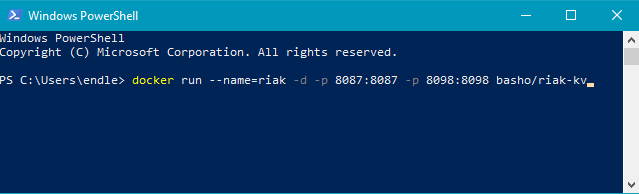

Докер завантажить зображення з Docker Hub (KV, TS) і запустив єдиний вузол

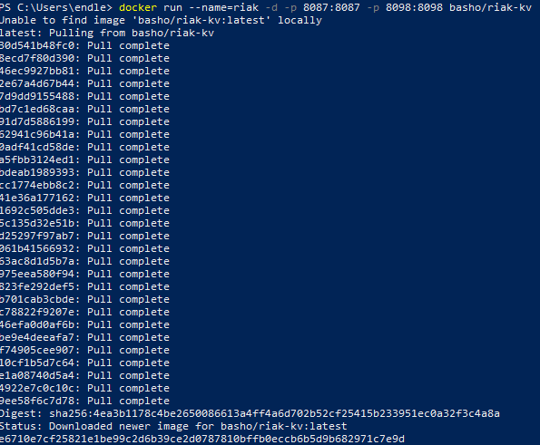

Riak Explorer постачається в комплекті з Riak у стандартному стилі Docker. Він надає повний HTTP-API, який додає функціональні можливості, недоступні в стандартному API Riak HTTP. Для відкриття Riak Explorer у веб-переглядачі, перейдіть на http://localhost:8098/admin/

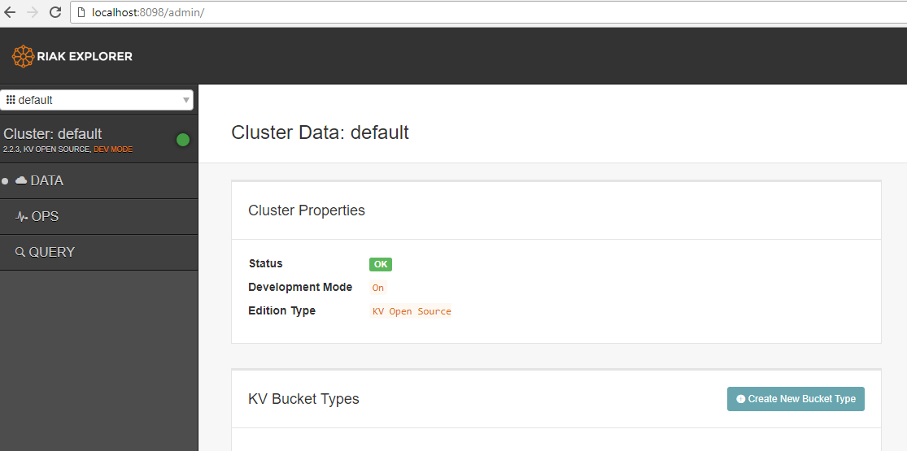

# Riak CRUD

Відкрийте утиліту Postman. Переконатися, що riak може отримувати HTPP – запити можна, відправивши запит GET на localhost:8098/ping

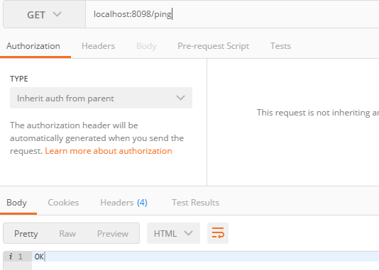

Тепер відправимо завідомо неправильний запит: GET localhost:8089/riak/no_bucket/no_key

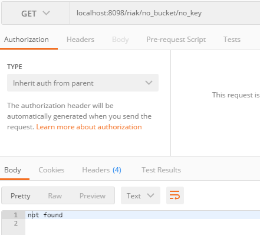

Так як робота Riak заснована на URL-адресах і діях, то використовуються заголовки і коди помилок, визначенні в протоколі HTTP. Відповідь з кодом 404 означає, що сторінка не знайдена - нема на що дивитися. А, отже, пора щось помістити в сховище Riak, скориставшись дієсловом PUT.

Відправте PUT – запит на localhost:8089/riak/fav/db із тілом ```<h1>Hello world</h1>```

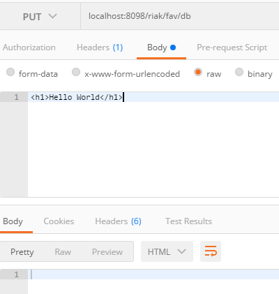

Побачити додані дані можна за допомогою GET – запиту на адресу localhost:8089/riak/fav/db

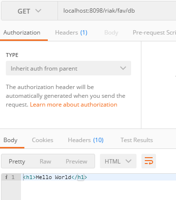

Riak - це сховище ключів і значень, і, отже, щоб получити значення, потрібно задати ключ. Riak розбиває всі ключі на сегменти (bucket), щоб уникнути колізій. наприклад, ключ для мови java може співіснувати з ключем для напою java5.

Ми хочемо створити систему для обліку тварин. Спочатку створимо сегмент animals, в якому будуть зберігатися відомості про тварин. URL-адресу влаштуємо таким чином:

```
http://SERVER:PORT/riak/BUCKET/KEY
```

Найпростіше помістити дані в сегмент Riak, якщо ключ заздалегідь відомий. Першим ми додамо пса, встановивши йому ключ ace і значення ```{"nickname": "The Wonder Dog "," breed ":" German Shepherd "}```. Створювати сегмент явно необов'язково - додавання першого ж значення в новий сегмент призводить до його створення

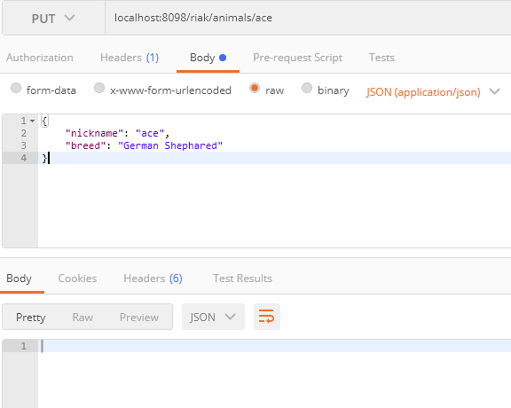

Якщо нам все одно, як буде називатися ключ, то Riak створить його самостійно, потрібно лише відправити POST-запит

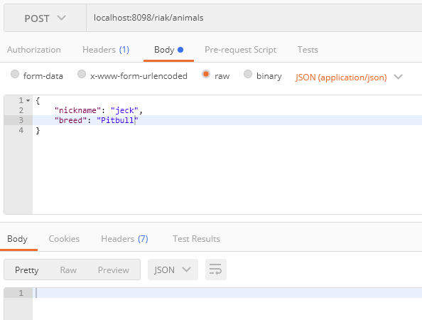

Якщо ми забули, які ключі є в сегменті, то можемо получити їх список задопомогою GET – запиту за адресою localhost:8098/riak/animals?keys=true

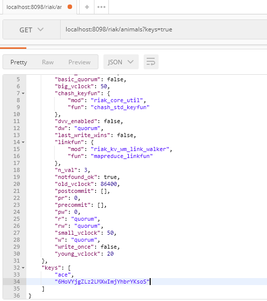

Запит методом DELETE видаляє ключ

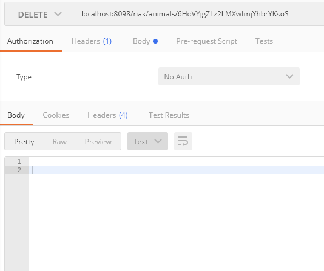

# Домашнє завдання

Проведіть CRUD - операції із наступними JSON - схемами в якості value:

## Варіанти

1. 
```json
{  
   "name":"Some name",
   "age":22,
   "phones":[  
      {  
         "type":"Personal",
         "number":"33-22-55"
      }
   ]
}
```

2. 
```json
{  
   "model":"Some car model",
   "number":"Some car number",
   "drivers":[  
      {  
         "name":"Some driver name",
         "age":"Some driver age"
      }
   ]
}
```

3. 
```json
{  
   "title":"Some book title",
   "authors":[  
      {  
         "name":"Some author name",
         "age":"Some author age"
      }
   ]
}
```


4. 
```json
{  
   "title":"Some title",
   "price":"some price",
   "reviews":[  
      {  
         "name":"Some user name",
         "review":"Some review text"
      }
   ]
}
```


5. 
```json
{  
   "title":"Some title",
   "price":"some price",
   "reviews":[  
      {  
         "name":"Some user name",
         "review":"Some review text"
      }
   ]
}
```


6. 
```json
{  
   "name":"Some Student Name",
   "studentCard":"Some Student Card",
   "subjects":[  
      {  
         "title":"Some subject title"
      }
   ]
}
```


7. 
```json
{  
   "houseNumber":"Some house number",
   "tenants":[  
      {  
         "name":"Some tenant name",
         "age":"Some tenant age"
      }
   ]
}
```

8. 
```json
{  
   "site-url":"Some site url",
   "description":"Some site description",
   "admins":[  
      {  
         "login":"Some admin login"
      }
   ]
}
```

9.  
```json
{  
   "title":"Some song title",
   "authrs":[  
      {  
         "name":"Some author name"
      }
   ]
}
```

10. 
```json
{  
   "number":"Some room number",
   "price":"Some room price",
   "tenants":[  
      {  
         "name":"Some tenant name"
      }
   ]
}
```

# Контрольні запитання

1. Що таке Riak?
2. Яку модель використовує Riak?
3. Як отримати запис із Riak?
4. Як додати запис в Riak?
5. Як модифікувати запис в Riak?
6. Як видалити запис в Riak?

