# MongoDB

${toc}

# Що таке MongoDB

Перша публічна версія MongoDB була випущена в 2009 році, а тепер це висхідна зірка в світі NoSQL. система задумувалась як масштабована база даних - назва Mongo походить від слова «humongous», отриманого об'єднанням «huge» (гігантскій) і «monstrous» (жахливий), а в якості основних проектних цілей були поставлені висока продуктивність і простота доступу до даних. Це документно - орієнтована база даних, яка дозволяє не тільк зберігати, але й писати складні запити для вибірки даних. Схема бази даних не нав'язується (в цьому MongoDB схожа на Riak, але відрізняється від Postgres), тому один документ може містити поля або типи, відсутні у всіх інших документах. Але не думайте, що гнучкість MongoDB перетворює її в іграшку. Цю базу даних використовують такі гігантські сайти, як Foursquare і bit.ly, а в Європейському центрі ядерних досліджень (ЦЕРН) вона застосовується для зберігання данних, що надходять з великого адронного коллайдера.

Mongo поєднує в собі потужні засоби запитів, характерною для реляційних баз даних, і розподілену архітектуру, властиву таким сховищ, як Riak або HBase. Засновник проекту Дуайт Меррімен (Dwight Merriman) говорить, що MongoDB - це та база даних, з якою він хотів би працювати в компанії DoubleClick, де обіймав посаду технічного директора і відповідав за побудову великомасштабного сховища даних, яке проте могло б відповідати на довільні запити.

Mongo - сховище JSON-документів (хоча, строго кажучи, данні зберігаються в двійковому варіанті JSON, який називається BSON). Документ Mongo можна уподібнити рядку реляційної таблиці без схеми, в якій допускається довільна глибина вкладеності значень.

Mongo - відмінний вибір для зростаючого класу веб-проектів, в яких необхідно працювати з великими масивами даних, але бюджет занадто малий для придбання дорогого обладнання. Завдяки відсутності структурованої схеми, Mongo може рости і змінюватися разом з моделлю даних. Якщо ви працюєте в недавно утвореної компанії, яка плекає грандіозні плани або вже накопичила стільки даних, що виникла потреба в горизонтальним масштабування, то придивіться до MongoDB.

# Встанновлення mongo в docker – контейнер

Завантажте зображення mongo за допомогою команди docker pull mongo

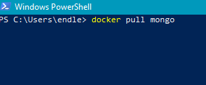

Запустіть контейнер за допомогою команди docker run -p 27017:27017 --name server-mongo -d mongo

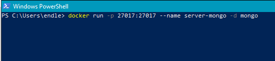

Для підключення до сервера нам знадобиться локальна установка MongoDB. Перейдіть на офіційний сайт MongoDB[www.mongodb.com] завантажте і скачкайте MongoDB.

Перейдіть в теку MongoDB і запустіть звідти PowerShell

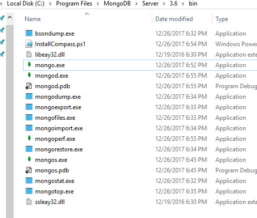

Виконайте команду ```./mongo```. Клієнт mongo автоматично знайте контейнер mongo, який ми запустили пізніше.

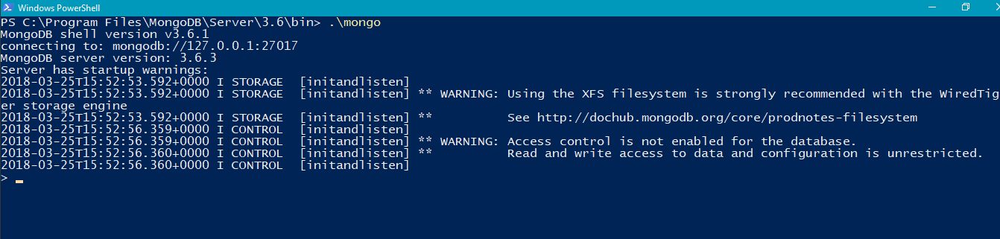

# Операції CRUD і вкладеність

Для створення бази даних і вказання її, в якості контексту виконайте команду use towns

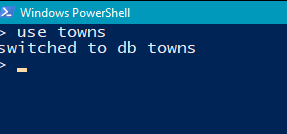

Для створення колекції (аналог сегмента в термінології Riak) в Mongo досить просто додати в неї перший запис. Оскільки в Mongo немає схем, то заздалегідь нічого визначати не треба. Більш того, навіть сама база даних towns фізично не існує, поки ми не додамо в неї перший документ. Наступний код створює колекцію towns і вставляє в неї дані

```js
db.towns.insert({
    name: “New York”,
    population: 22200000,
    last_census: ISODate(“2009-07-31”),
    famous_for: [ “statue of liberty”, “food” ],
    mayor : {
        name : “Michael Bloomberg”,
        party : “I”
    }
})
```

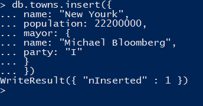

Вище ми згадували, що документи зберігаються в форматі JSON (точніше, BSON), тому в такому форматі ми їх і додаємо. Фігурни дужки {...} позначають об'єкт (аналог асоціативного масиву або хеш-таблиці), що містить ключі і значення, а квадратні дужки [...] - лінійний масив. Значення можуть бути вкладеними, причому глибина вкладеності не обмежена. команда show collections дозволить переконатися, що колекція дійсно існують.

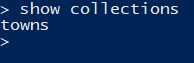

Переглянутися вміст Колекції дозволяє команда find ()

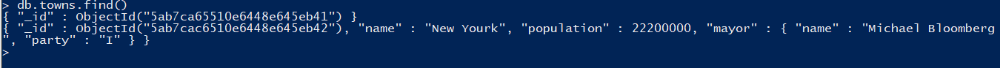

На відміну від реляційних СУБД, Mongo не підтримує з’єднання на стороні сервера. Один виклик JavaScript-функції витягує документ і всі вкладені в нього дані.

Можливо, ви звернули увагу на доданий системою поле _id типу ObjectId. Це близький аналог ключового слова SERIAL. Об'єкт ObjectId завжди займає 12 Байтів і складається з тимчасової мітки, ідентифікатора клієнтської машини, ідентифікатора клієнтського процесу та 3-байтового інкрементованого лічильника.

Раніше ми викликали функцію find () без параметрів, щоб отримати всі документи. Для отримання конкретного документа досить задати властивість _id. Оскільки _id має тип ObjectId, то для формування запиту необхідно перетворити рядок до цього типу, обернувши його функцією ObjectId (str)

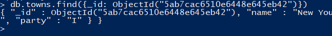

Функція find() приймає і ще один параметр: об'єкт, який дозволяє вказати, які поля витягати з бази. Якщо вас цікавить тільки назва міста (і його _id), передайте об'єкт, в якому властивість name приймає значення 1 (або true)

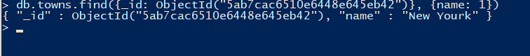

**Модифікація документів.** Функція update (criteria, operation) приймає два обов’язкових параметра. Перший - критерій відбору - такий же, як для функції find(). Другий - або об'єкт, поля якого замінюють поля відібраних документів, або модифікатор. В даному випадку модифікатор $set записує в поле population значення 2

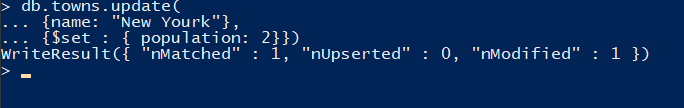

Може виникнути питання, навіщо взагалі потрібна операція $set. Mongo не працює в термінах атрибутів; на внутрішньому рівні є лише неявне уявлення про атрибути для цілей оптимізації. Однак в інтерфейсі Mongo ніякі атрибути не згадуються, є тільки документи. Навряд чи ви коли-небудь захочете виконати дещо в такому роді (зверніть увагу на відсутність оператора $set):

```js
db.towns.update(
{ _id : ObjectId(“4d0ada87bb30773266f39fe5”) },
{ state : “OR” }
);
```

В цьому випадку весь відповідний документ був би замінений пере-даними вами документом ({state: "OR"}). Раз ви не вказали команду $set, Mongo вважає, що ви просто хочете цілком замінити документ. Будьте обережні.

Видалити документи з колекції нескладно. Досить замість функції find () скористатися функцією remove () - і всі документи, які задовольняють критерію, будуть видалені. Важливо відзначити, що видаляється документ цілком, а не тільки елемент, що збігаються або під-документами

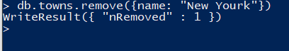

# Домашнє завдання

Проведіть CRUD - операції із наступними JSON - схемами.

## Варіанти

1. 
```json
{  
   "name":"Some name",
   "age":22,
   "phones":[  
      {  
         "type":"Personal",
         "number":"33-22-55"
      }
   ]
}
```

2. 
```json
{  
   "model":"Some car model",
   "number":"Some car number",
   "drivers":[  
      {  
         "name":"Some driver name",
         "age":"Some driver age"
      }
   ]
}
```

3. 
```json
{  
   "title":"Some book title",
   "authors":[  
      {  
         "name":"Some author name",
         "age":"Some author age"
      }
   ]
}
```

4. 
```json
{  
   "title":"Some title",
   "price":"some price",
   "reviews":[  
      {  
         "name":"Some user name",
         "review":"Some review text"
      }
   ]
}
```

5. 
```json
{  
   "title":"Some title",
   "price":"some price",
   "reviews":[  
      {  
         "name":"Some user name",
         "review":"Some review text"
      }
   ]
}
```

6. 
```json
{  
   "name":"Some Student Name",
   "studentCard":"Some Student Card",
   "subjects":[  
      {  
         "title":"Some subject title"
      }
   ]
}
```

7. 
```json
{  
   "houseNumber":"Some house number",
   "tenants":[  
      {  
         "name":"Some tenant name",
         "age":"Some tenant age"
      }
   ]
}
```

8. 
```json
{  
   "site-url":"Some site url",
   "description":"Some site description",
   "admins":[  
      {  
         "login":"Some admin login"
      }
   ]
}
```

9.  
```json
{  
   "title":"Some song title",
   "authrs":[  
      {  
         "name":"Some author name"
      }
   ]
}
```

10. 
```json
{  
   "number":"Some room number",
   "price":"Some room price",
   "tenants":[  
      {  
         "name":"Some tenant name"
      }
   ]
}
```

# Контрольні запитання

1. Що таке MongoDB?
2. Яку модель використовує MongoDB?
3. Як додати запис в БД?
4. Як знайти запис в БД?
5. Як модифікувати запис в БД? Для чого використовується модифікатор $set?
6. Як видалити запис із БД?