# Cassandra

${toc}

# Apache Cassandra

Apache Cassandra — розподілена система керування базами даних, що відноситься до класу NoSQL-систем і розрахована на створення високомасштабованих і надійних сховищ величезних масивів даних, представлених у вигляді хеша.

Спочатку проект був розроблений в надрах Facebook і в 2009 році переданий під оруду фонду Apache Software Foundation. Промислові рішення на базі Cassandra розгорнуті для забезпечення сервісів таких компаній, як Cisco, IBM, Cloudkick, Reddit, Digg, Rackspace і Twitter. Станом на 2011 рік найбільший кластер серверів, котрий обслуговує єдину БД Cassandra, налічує понад 400 машин і містить дані розміром понад 300 Тб.

Бази даних сімейства колонок використовують поняття, яке називається простором ключів. Простір ключів подібний до схеми реляційної моделі. Простір ключів містить всі сімейства стовпців (подібні до таблиці в реляційній моделі), які містять рядки і стовпці. Приклад простору ключів показано на рис. 1. Приклад сімейства колонок показано на рис. 2. На двох рисунках показано:
- Сімейство колонок, яке складається з двох рядків.
- Кожен рядок може містити довільну кількість стовпців. І стовпці не повинні відповідати стовпцям інших рядків (тобто вони можуть мати різні назви стовпців, типи даних тощо).
- Кожен стовпець відноситься до рядка. Він не охоплює всі рядки, як у реляційній базі даних. У кожному стовпці містяться пара назв / значення разом із міткою часу. Зауважте, що у цьому прикладі використовується час Unix / Epoch для позначки часу.

Простір ключів в сімействі колонок:

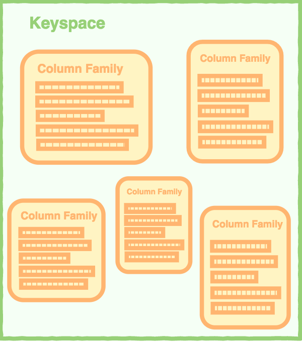

Приклад сімейства колонок:

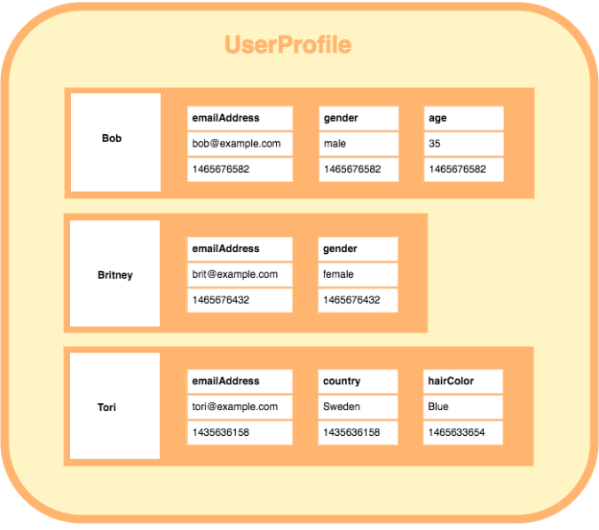

Приклад рядка в сімействі колонок:

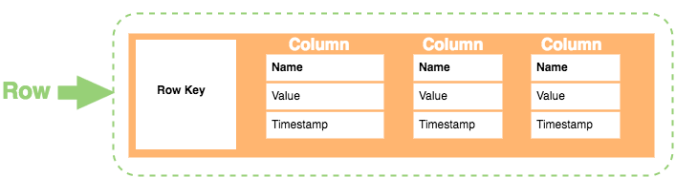

В рядку містяться:
- Row Key. Кожен рядок має унікальний ключ, який є унікальним ідентифікатором для цього рядка.
- Column. Кожна колонка має ім’я, значення і мітку часу.
- Name. Ім’я пари ключ/значення.
- Value. Значення пари ключ/значення.
- Timestamp. Дату та час введення даних. Це може бути використано для визначення останньої версії даних.

Переваги моделі сімейство колонок:
- Стиснення даних. Сімейства колонок дуже ефективні при стисненні та / або розбитті даних.
- Агрегування запитів. Через їх структуру стовпчикові бази даних особливо добре працюють з агрегатними запитами (такими як SUM, COUNT, AVG та ін.).
- Масштабованість. Колоночні бази даних дуже масштабовані. Вони добре підходять для масово паралельної обробки (MPP), що передбачає наявність даних, що поширюються через велике скупчення машин - часто тисячі машин.
- Швидке завантаження і виконання запитів. Колонні магазини можуть завантажуватися надзвичайно швидко. За кілька секунд можна завантажити таблицю рядків на мільярд. Ви можете почати запити та аналіз майже відразу.

В останніх версіях Cassandra з'явилася можливість виконувати запити визначення та маніпуляції даних (DDL, DML) за допомогою CQL мови, а також створювати вторинні індекси.

# Розгортання docker – контейнера і запуск оболонки cqlsh

Для завантаження і запуск docker – контейнера достатньо виконати наступну команду

```bash
docker run --name server-cassandra -d cassandra:latest
```

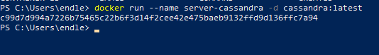

Для того щоб запустити оболонку cqlsh запустимо ще один контейнер, який буде використовувати попередній, в якості сервера

```bash
docker run -it --link server-cassandra:cassandra --rm cassandra sh -c 'exec cqlsh "$CASSANDRA_PORT_9042_TCP_ADDR"'
```

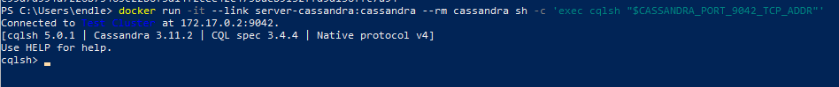

# Створення і використання простору ключів

Простір ключів в Cassandra - це простір імен, який визначає реплікацію даних у вузлах. Кластер містить однин простір ключів на вузол. Нижче наведено синтаксис створення простору ключів за допомогою оператора CREATE KEYSPACE:

```bash
CREATE KEYSPACE <identifier> WITH <properties>
```

Приклади команди:

```bash
CREATE KEYSPACE “KeySpace Name”
WITH replication = {'class': ‘Strategy name’, 'replication_factor' : ‘No.Of   replicas’};

CREATE KEYSPACE “KeySpace Name”
WITH replication = {'class': ‘Strategy name’, 'replication_factor' : ‘No.Of  replicas’}

AND durable_writes = ‘Boolean value’;
```

Вираз CREATE KEYSPACE має дві властивості: replican і durable_writes.

Опція реплікації - вказує стратегію розміщення репліки та кількість бажаних копій. У наведеній нижче таблиці наведено всі стратегії розміщення репліки.

|Назва стратегії реплікації|Пояснення|
|-|-|
|Simple Strategy|Визначає простий коефіцієнт реплікації для кластера|
|Network Topology Strategy|Використовуючи цей параметр, ви можете самостійно встановити коефіцієнт реплікації для кожного центру обробки даних.|
|Old Network Topology Strategy|Це  стратегія реплікації.|

Створіть новий простір ключів за допомогою наступної команди

```bash
CREATE KEYSPACE Users WITH replication = {'class':'SimpleStrategy', 'replication_factor':3};
```

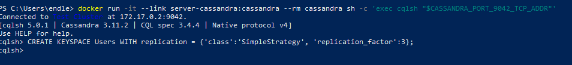

Ви можете перевірити, чи створено таблицю, використавши команду Describe. Якщо ви скористаєтесь цією командою відносно простору ключів, вона відображатиме всі простори, які було створено

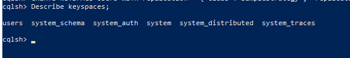

Для того, щоб вказати, що всі наступні запити будуть відбуватися саме в цьому просторі ключів потрібно виконати команду Use, синтаксис, якої приведено нижче:

```
Syntax:USE <identifier>
```

Для того щоб використати, створений нами простір ключів потрібно виконати команду: Use Users

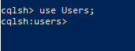

# Створення таблиці і колонок

Ви можете створити таблицю за допомогою команди CREATE TABLE. Нижче наведено синтаксис створення таблиці.

```
CREATE (TABLE | COLUMNFAMILY) <tablename>
('<column-definition>' , '<column-definition>')
(WITH <option> AND <option>)
```

Ви можете визначити стовпець, як показано нижче.

```
column name1 data type,
column name2 data type,

example:

age int,
name text
```

Первинний ключ - це стовпчик, який використовується для унікального визначення рядка. Первинний ключ складається з одного або декількох стовпців таблиці. Ви можете визначити первинний ключ таблиці, як показано нижче.

```
CREATE TABLE tablename(
column1 name datatype PRIMARYKEY,
column2 name data type,
column3 name data type.
)
```

Або:

```
CREATE TABLE tablename(
column1 name datatype PRIMARYKEY,
column2 name data type,
column3 name data type,
PRIMARY KEY (column1)
)
```

Приклад:

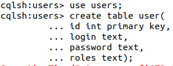

Інструкція SELECT дасть вам схему. Перевірте таблицю за допомогою оператора select, як показано нижче.

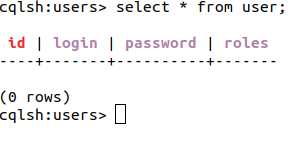

Ви можете вставити дані в стовпці ряду в таблиці за допомогою команди INSERT. Нижче наведено синтаксис для створення даних у таблиці.

```
INSERT INTO <tablename>
(<column1 name>, <column2 name>....)
VALUES (<value1>, <value2>....)
USING <option>
```

Приклад:

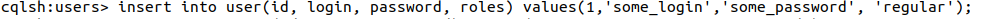

Після введення даних, використовуйте оператор SELECT, щоб перевірити, чи були дані вставлені чи ні.

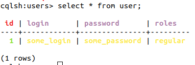

UPDATE - це команда, яка використовується для оновлення даних у таблиці. Під час оновлення даних у таблиці використовуються такі ключові слова:
- WHERE – це слово використовується для вибору ряду, що підлягає оновленню.
- SET – Встановлює нове значення.
- MUST - Включає всі стовпці, що складають первинний ключ.

Під час оновлення рядків, якщо певний рядок недоступний, UPDATE створює новий рядок. Нижче наведено синтаксис команди UPDATE:

```
UPDATE <tablename>
SET <column name> = <new value>
<column name> = <value>....
WHERE <condition>
```

Приклад:

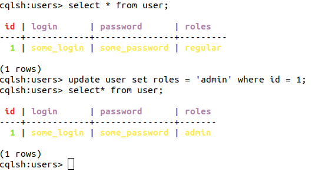

Ви можете видалити дані з таблиці за допомогою команди DELETE. Її синтаксис виглядає наступним чином:

```
DELETE FROM <identifier> WHERE <condition>;
```

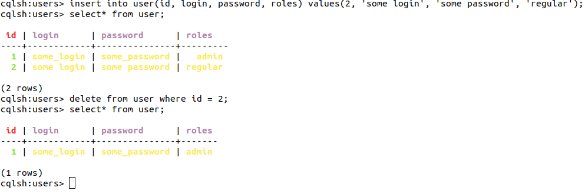

Мова запитів Cassandra (CQL) була створена для забезпечення необхідної абстракції. CQL цілеспрямовано схоже на Structured Query Language (SQL), що використовується в реляційних базах даних, як MySQL та Postgres. Ця подібність знижує бар'єр входу для користувачів, які знайомі з реляційними базами даних. Багато запитів дуже схожі між ними.

Кассандра є не реляційною базою даних, і тому використовує різні поняття для зберігання та отримання даних. Простіше кажучи, Cassandra keyspace є базою даних SQL, а сім'я стовпців Cassandra - це таблиця SQL (CQL дозволяє вам для обмінювати "TABLE" і "COLUMNFAMILY" для зручності). Ця різниця вимагає іншого синтаксису для створення та обробки даних.

 Жоден з стандартних реляційних матеріалів не буде працювати в CQL. Немає підтримки таких речей, як JOIN, GROUP BY або FOREIGN KEY. Залишення цих функцій є важливим, оскільки він набагато ефективніший для написання та отримання даних.

# Домашнє завдання

Створіть таблицю згідно із варіантом і виконайте CRUD - операції

## Варіанти

1. Створіть keyspace = blog. Створіть таблицю post(id,date,user,short_description, post_text).
2. Створіть keyspace = shop. Створіть таблицю client(id, name, age, gender).
3. Створіть keyspace = football. Створіть таблицю player(id, name, number, position, salary).
4. Створіть keyspace = library. Створіть таблицю book(id, title, authors, publish_date).
5. Створіть keyspace = parking. Створіть таблицю car(id, number, model, color).
6. Створіть keyspace = soft_shop. Створіть таблицю soft(id, title, price, description).
7. Створіть keyspace = bank. Створіть таблицю account(id, balance, type, expired_at).
8. Створіть keyspace = university. Створіть таблицю student(id, name, student_card).
9. Створіть keyspace = places. Створіть таблицю adress(id, city, street, number).
10. Створіть keyspace = sites. Створіть таблицю site(id, site_url, description, rank).

# Контрольні запитання